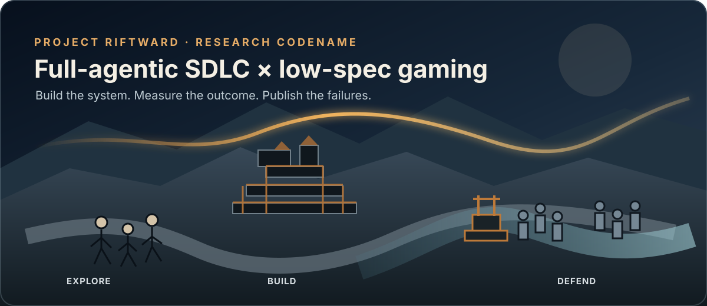
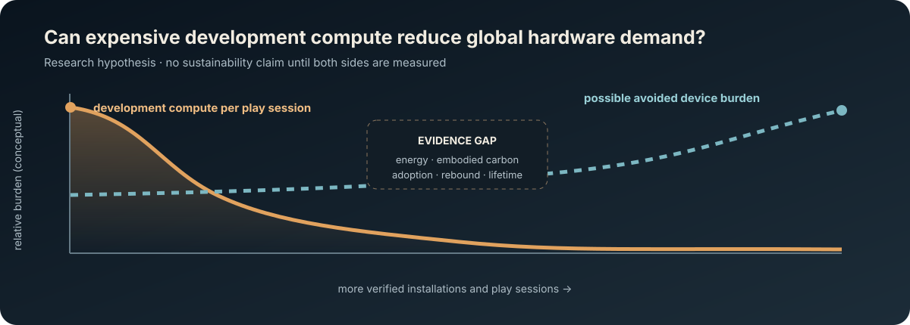

<p align="center">
  
</p>

<p align="center">
  <a href="https://github.com/Koschnag/ai-fantasy-rts-rpg/actions/workflows/verify.yml"></a>
  <a href="https://github.com/Koschnag/ai-fantasy-rts-rpg/actions/workflows/dotnet-asset-calibration.yml"></a>
  
  
</p>

# Project Riftward

**Can a full-agentic software delivery chain build a modern-feeling game for
genuinely old hardware?**

Project Riftward is an open, exploratory engineering case study wrapped around
an original dark-fairytale RTS/RPG. It combines hero-led exploration,
community building and army-scale strategy while treating 1080p performance on
i7-3770-/GTX-660-class PCs and an 8 GB M1 as a product constraint from the
start.

The second research object is the production system itself: versioned intent,
agent missions, local retrieval and memory, hard gates, recovery, provenance
and independently reviewable evidence. A model response is a candidate; only a
measured outcome advances the project.

> **Honest status (2026-08-23):** the reproducible production foundation exists;
> the game runtime and gameplay do not yet. `T-001`–`T-007` are accepted. The
> native SDL3/bgfx walking skeleton is the next implementation milestone.

`Project Riftward` is an internal research codename pending naming/trademark
review.

## Two experiments, one repository

| Agentic SDLC | Low-spec game engineering |
|---|---|
| How long can agents converge without human input? | How much atmosphere and tactical readability fit inside fixed budgets? |
| Which specifications and oracles actually prevent drift? | Can a lean runtime avoid hardware escalation instead of hiding it behind presets? |
| What do failed runs cost and teach? | Do measured player outcomes justify the development compute? |
| Can every accepted change be traced to intent and evidence? | Where do CPU, GPU, RAM, VRAM and content budgets really break? |


The idea that heavy one-time development compute could reduce hardware demand
across many players is explicitly a **hypothesis**, not a sustainability claim.
The project will not invent missing provider-energy data or ignore embodied
hardware cost, adoption and rebound effects. See the
[research protocol](docs/research/PROTOCOL.md).

## What is real today

- a local F#/.NET harness with tamper-evident run ledger, curated memory,
  deterministic BM25 retrieval, evidence binding and retention controls
- a fail-closed clean-room and asset-provenance gate
- a deterministic in-process generator that writes a calibration GLB and CPU
  preview without network access, subprocesses or a DCC runtime
- an independent inspector and fresh-checkout CI for the generator pipeline
- fixed platform, frame-time, memory, scene and effect budgets before runtime
  content scales
- an original world/art bible and quarantined, manifested concept research

## What is not real yet

- no playable game or representative gameplay loop
- no proven 30/60 FPS result on the target hardware
- no evidence that the system can productively run for several days without
  intervention
- no finished-game scope, ecological benefit or general superiority claim
- no blanket approval of AI-generated concepts, models, animation or video

Concept art is never presented as gameplay. Generated raster/3D outputs remain
in ignored local quarantine until their technical, originality and license
reviews pass; Git tracks their specifications, manifests and receipts. The
public diagrams in this README are deterministic project-authored SVGs.

## Game hypothesis

The player arrives as a mortal cartographer and field engineer in a wounded
ring-continent. Regions intermittently overlap with possible past or future
material states. Understanding a place grows into responsibility for people,
infrastructure and battles: exploration informs settlement, settlements change
the landscape, and strategic outcomes remain personally visible.

The target tone is wistful, earthy, wondrous and determined. Magic is rare,
material and rule-bound; hope comes from work and relationships rather than
permanent spectacle.

## Hardware contract

| Profile | Target |
|---|---|
| PC minimum | i7-3770, GTX 660, 8 GB RAM, 1920×1080 Low, 30 FPS |
| Mac minimum | Apple M1, 8 GB unified memory, 30 FPS |
| high preset ceiling | RX-580 class, 1920×1080 High, 60 FPS preferred |

No ray tracing or real-time global illumination path is planned. Baked
lighting, probes, LOD, culling, instancing and controlled VFX must earn visual
quality inside the budget. Full thresholds are versioned in
[PERFORMANCE_BUDGET.md](docs/PERFORMANCE_BUDGET.md).



## Research and build-in-public

- [case-study overview](docs/research/README.md)
- [research protocol and falsification signals](docs/research/PROTOCOL.md)
- [mapping to Cong-Driven Development](docs/research/CCD_MAPPING.md)
- [dated baseline and experiment log](docs/research/CASE_STUDY_LOG.md)
- [campaign and claim rules](docs/communication/CAMPAIGN.md)
- [visual, 3D, animation and film lab](docs/communication/MEDIA_LAB.md)
- [40-second research-teaser storyboard](docs/communication/STORYBOARD-001.md)

The case study is a practical probe for
[Cong-Driven Development](https://github.com/Koschnag/cong-driven-development)
and the proposition of working *on the system* rather than merely *in the
system* described in
[“Software Engineering im KI-Zeitalter: Gegenthese zum Hype”](https://de.linkedin.com/pulse/software-engineering-im-ki-zeitalter-gegenthese-zum-hype-nguyen-imnof).
It does not currently claim full CCD conformance.

## Run the evidence gates

Prerequisites and platform setup are documented in
[TOOLCHAIN.md](docs/TOOLCHAIN.md).

```bash
./scripts/rift.sh bootstrap
./scripts/rift.sh build
./scripts/rift.sh lint
./scripts/rift.sh test
./scripts/rift.sh security
./scripts/rift.sh assets-check
./scripts/rift.sh rag-build
./scripts/rift.sh verify
./scripts/rift.sh fresh-checkout-test
./scripts/dotnet-asset-calibration-ci.sh
```

Production gates that have no accepted implementation fail explicitly. They do
not return a cosmetic green result.

## Repository map

| Start here | Purpose |
|---|---|
| [PROJEKT.md](PROJEKT.md) | problem, scope and outcome |
| [BACKLOG.md](BACKLOG.md) | prioritized, status-bound implementation units |
| [AGENTS.md](AGENTS.md) | binding rules for implementing agents |
| [docs/HARNESS.md](docs/HARNESS.md) | runs, memory, retrieval and evidence |
| [docs/AUTOMATION.md](docs/AUTOMATION.md) | autonomous production loop and checkpoints |
| [docs/ARCHITEKTUR.md](docs/ARCHITEKTUR.md) | technical boundaries |
| [docs/ATMOSPHAERE.md](docs/ATMOSPHAERE.md) | world, tone and measurable art/gameplay rubric |
| [docs/ASSET_PIPELINE.md](docs/ASSET_PIPELINE.md) | synthetic asset lifecycle |
| [docs/CLEAN_ROOM.md](docs/CLEAN_ROOM.md) | separation from external creative works |
| [docs/IP_UND_LIZENZEN.md](docs/IP_UND_LIZENZEN.md) | license and provenance policy |
| [docs/QUALITAET.md](docs/QUALITAET.md) | acceptance and Definition of Done |
| [docs/entscheidungen/](docs/entscheidungen/) | architecture decision records |

Status is semantic: `READY` permits implementation; `DONE` means implemented,
tested and accepted. Open product decisions may not be silently invented by an
agent.

## Contributing and citation

Reproductions, hardware traces, methodological criticism and narrowly scoped
gate improvements are welcome; see [CONTRIBUTING.md](CONTRIBUTING.md). A
structured experiment issue template is available on GitHub.

Use [CITATION.cff](CITATION.cff) and cite the exact commit evaluated. The
repository's own software/content license is still an open product decision;
the presence of third-party FOSS dependencies does not make all project code or
media FOSS.
