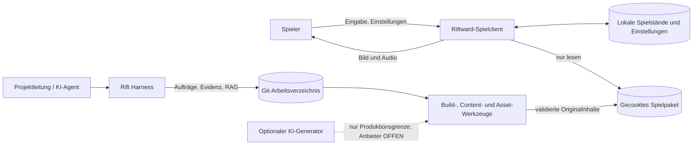
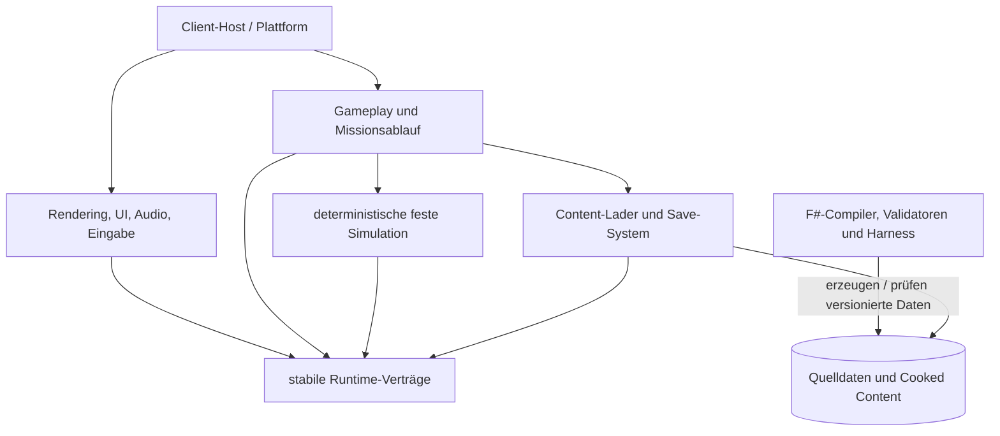

# Architektur und technische Leitplanken

Dieses Dokument beschreibt den beabsichtigten Systemzuschnitt. Bestätigte Technikentscheidungen stehen ausschließlich in den ADRs; noch zu messende oder fachlich zu entscheidende Punkte bleiben `OFFEN`.

## Systemkontext

Project Riftward besteht aus einem offline lauffähigen Einzelspieler-Client und einer davon getrennten Produktionsumgebung. Der ausgelieferte Client benötigt weder Konto noch Cloud-Dienst. KI-Dienste dürfen nur in der Produktion eingesetzt werden und werden niemals Runtime-Abhängigkeit.

## Schichten und Abhängigkeitsrichtung

- Simulation und Gameplay kennen keine SDL3-, bgfx- oder Betriebssystemtypen.
- Darstellung konsumiert Simulations-Snapshots und erzeugt Spielerbefehle; sie verändert den Weltzustand nicht direkt. Für Lastpfade mit Allokationsbudget (T-023) ist der äquivalente schreibgeschützte Zugriff auf die öffentlichen Zustandsleser des Simulationskerns zugelassen; mutierende Aufrufe bleiben der Lauf-Treiberschicht vorbehalten.
- Quelldaten und Rohassets gelangen nie ungeprüft in das Runtime-Paket.
- Offline-Werkzeuge dürfen mehr Komfort und JIT verwenden; der Clientkern bleibt AOT-/Trimming-freundlich.

## Komponenten

| Komponente | Verantwortung | Hauptschnittstellen / Daten | Sensible Daten | Status |
|---|---|---|---|---|
| Client-Host | Prozessstart, Lebenszyklus, Plattformwahl, Fehlergrenze, Taktung | eigene kleine C#-Verträge; Runtime-Konfiguration | lokale Pfade, Diagnoseprotokolle | ENTSCHIEDEN im Grundsatz |
| Plattform-Layer | Fenster, Eingabe und Plattformintegration | SDL3 über kleine `LibraryImport`-Wrapper | keine Konten; nur lokale Eingaben | ENTSCHIEDEN, ADR 002 |
| Render-Frontend | szenenbezogene Draw-Daten, LOD, Culling, Instancing, Beleuchtung und Qualitätsstufen | eigene Render-API zu bgfx; D3D11/OpenGL 3.3/Metal | keine | ENTSCHIEDEN, ADR 002 |
| Audio-Layer | Musik-, Umgebungs- und Effektwiedergabe mit Prioritäten | SDL3-Core-Audio oder SDL3_mixer | keine | OFFEN bis Audio-Spike |
| Simulation | fester Tick, Akteure, Befehle, Kampf, Wirtschaft, Navigation, Fog of War und Zustands-Hashes | reine Datenverträge, Seed und geordnete Befehle | keine | ANGENOMMEN |
| Gameplay / Mission | Helden, Fähigkeiten, Ausrüstung, Aufgaben, Dialoge, Entscheidungen, Basis und Missionsregeln | versionierte Content-Definitionen und Simulationsereignisse | keine | ANGENOMMEN |
| Präsentation / UI | Kamera, Auswahl, Befehlsfeedback, HUD, Menüs, Untertitel und Minimap | lesbare Snapshots; semantische Aktionen statt Gerätescancodes | Eingabebelegung lokal | ANGENOMMEN |
| Content-Lader | validierte, gecookte Definitionen und Assets laden; Handle-/ID-Auflösung | read-only Spielpaket mit Schema- und Paketversion | keine | ANGENOMMEN; Paketformat OFFEN |
| Save-System | atomar speichern/laden, Version prüfen, Korruption kontrolliert melden | lokaler Spielstand gemäß `DATENMODELL.md` und Savevertrag `SAVEVERTRAG.md` | Spielverlauf, Einstellungen | ANGENOMMEN; Simulationszustand durch Savevertrag V1 festgelegt; Cooked-Paket-, Definitions-, Replay- und Einstellungsformate OFFEN |
| Entwicklungs-Telemetrie | Frame-, Tick-, Allokations-, Agenten-, Draw-, RAM-/VRAM- und Streamingwerte | maschinenlesbare lokale Messartefakte | Geräte-/Pfadangaben minimieren | ANGENOMMEN |
| Rift Harness | Runs, Hashkette, BM25-RAG, Zitate und Prüfevidenz | `.ai/`-Verträge und CLI aus `HARNESS.md` | Prompts/Logs können Secrets enthalten und werden bereinigt | ENTSCHIEDEN, ADR 003 |
| Content-/Asset-Pipeline | Quelldaten validieren, Originalassets normalisieren, LOD/Material/Rig prüfen und cooken | Asset-Manifeste, Hashes, Blender-/CLI-Artefakte | optionale Provider-Credentials außerhalb des Repos | ANGENOMMEN |

## Technische Entscheidungen

| Thema | Festlegung | Quelle | Status |
|---|---|---|---|
| Runtime und Sprachen | .NET 10 LTS; C# für Host, Interop und Hotpaths; F# für Harness, Compiler und Validatoren | ADR 001 | ENTSCHIEDEN |
| Release-Modus | Native AOT und selbstenthaltene CoreCLR-Builds messen; pro Zielsystem nativ bauen | ADR 001 | ENTSCHIEDEN als Auswahlverfahren, Ergebnis OFFEN |
| Fenster / Eingabe / Plattform | SDL3 | ADR 002 | ENTSCHIEDEN |
| Rendering | bgfx; Windows D3D11, Linux OpenGL 3.3, macOS Metal; Vulkan nur optional nach Messung | ADR 002 | ENTSCHIEDEN |
| Audio | Spike zwischen SDL3-Core-Audio und SDL3_mixer; nur benötigte Decoder ausliefern | ADR 002 | OFFEN |
| Persistenz | lokale versionierte Saves, Einstellungen und Checkpoints; keine Runtime-Datenbank; der Save-Umschlag/das Persistenzformat des Simulationszustands folgt dem versionierten Savevertrag (`docs/SAVEVERTRAG.md`, T-031) mit kanonischer Binärcodierung, doppeltem Hashanker und atomarem Slotprotokoll | Anforderungen F-005/F-006; ADR 006 | ANGENOMMEN; Cooked-Paket-, Definitions- und Replayformate bleiben OFFEN |
| Produktion | lokales F#-Harness, JSONL-Ereignisse und BM25-RAG; kein Pflicht-Cloud-Dienst | ADR 003 | ENTSCHIEDEN |
| Performancebeweis | Budgets bleiben Hypothesen bis zum Release-nahen Lauf auf realer Referenzhardware; isolierte Baselines plus integrierter Repräsentativitätsnachweis | ADR 006 | ENTSCHIEDEN |
| Sprachrollen | C# für ausgelieferte Runtime; F# für typisierte Offline-Spezifikation, Compiler, Referenzmodelle und Verifikation; Python nur optionaler untrusted Offline-Adapter | ADR 001, ADR 006 | ENTSCHIEDEN |
| Integration | Arbeitsbranch → Pull Request → verpflichtende Gates → Squash-`main`; kein agentischer Direkt-Push auf `main` | ADR 006 | ENTSCHIEDEN |
| Distribution | eigenständige Pakete für Windows x64, Linux x64 und macOS arm64 | NF-006 | ENTSCHIEDEN im Ziel; konkrete Paketform/Stores OFFEN |
| Authentifizierung | kein Konto, keine Rollen und keine Bezahlung im Spielclient | NF-004 / MVP-Grenze | NICHT ZUTREFFEND |

## Laufzeitverträge

### Simulation und Darstellung

- Die Simulation läuft für den Vertical Slice mit 20 Hz gemäß `PERFORMANCE_BUDGET.md`; Rendering ist entkoppelt und darf interpolieren.
- Spieleraktionen werden als validierte, tickbezogene Befehle übergeben. Direkte UI-Mutation an Simulationsobjekten ist verboten.
- Gleicher Datenstand, Seed und dieselbe geordnete Befehlsfolge müssen innerhalb der noch festzulegenden Numerik-/Plattformtoleranz denselben fachlichen Zustand erzeugen. Numerik und exakter Hashvertrag werden im Technik-Spike festgelegt.
- Frame- und Simulationsbudgets aus `PERFORMANCE_BUDGET.md` sind API-Anforderungen: unbeschränkte Arbeit, versteckte Allokation und synchrones Rohasset-Laden in Hotpaths sind nicht zulässig.
- Der Simulationskern der Baseline T-021 (`Riftward.Simulation`) ist BCL-only, referenzfrei von SDL3-, bgfx-, Plattform- und Präsentationstypen und folgt dem versionierten Vertrag in `docs/SIMULATIONSVERTRAG.md` (Festkomma-Numerik Q16.16, Hashvertragsklassen, kanonische Ordnung, hierarchisch budgetierte Pfadsuche); Cross-Build-/Cross-Plattform-Hashgleichheit bleibt bis zu echter Messung unbehauptet.
- Der Zuverlässigkeitsnachweis NF-002 (T-022) führt denselben unveränderten Simulationskern als wiederholungsbasierten Replay-Soak aus und folgt dem versionierten Soakvertrag in `docs/SOAKVERTRAG.md` (V2: mindestens drei Fresh-Prozess-Läufe über den kompletten Planhorizont, absolute Leak-Schwellwerte mit Konsistenzbedingung, Fortschritts-Watchdog, ausgewiesenes Restrisiko); der Simulationszustand bleibt dabei frei von Uhr-, Umgebungs- und Kernzahlabhängigkeit, die Taktquelle treibt nur die Ausführungsdichte.
- Die interaktive Graybox-Kommandoschleife (T-032) ist ein Sitzungsmodus über demselben unveränderten Kern: Der BCL-only Sitzungs-/Befehlskern `Riftward.Session` bildet validierte Intents ausschließlich auf die öffentliche Kernbefehlsfläche (`SimCommandKind.GroupMoveToZone`, kanonische Ordnung) ab und folgt dem versionierten Kommandovertrag in `docs/KOMMANDOVERTRAG.md` V1. Auswahl und Kamera sind rein darstellseitig, gehören niemals zum Simulationszustand oder Hash, und Geräte-/Skripteingaben werden vor der Kernübergabe vollständig auf Wertebereiche, Typen und Duplikate geprüft (Vertrauensgrenze unten).
- Der Moduswechsel zwischen strategischer RTS-Sicht und direkter Third-Person-Heldensteuerung ist ein Präsentations-/Eingabekontextwechsel über demselben unveränderten Kern (ADR 008): Der aktuelle Modus ist nie Teil des Simulationszustands oder Hashes, wird an einer definierten Tickgrenze deterministisch aufgelöst und erzeugt aus sich heraus keinen Kernbefehl. RTS- und RPG-Eingabekontexte bleiben getrennt und lecken nicht ineinander; beide Modi erzeugen ausschließlich validierte, tickgebundene Befehle auf derselben autoritativen Simulation. Nah- und Fernsicht werden innerhalb der gebundenen Performancebudgets je Perspektive gemessen; ein Pass in nur einer Perspektive ist kein Hybrid-Pass. Die Wechseldetails sind versionierte, reversible Hypothesen des zugehörigen Modevertrags; seit der autorisierten Savevertrags-V2-Präzisierung (T-037) ist der aktive Modus samt schwebender Wechsel über die additive Sitzungssektion in Save/Load fortsetzbar, während die Replay-Ausnahme besteht und die finale Wechsel-Detailregel Q-GAM-010 `OFFEN` bleibt.
- Der opt-in Erkundungsauftrag (T-034) ist eine rein beobachtende, sitzungslokale Schicht in `Riftward.Session` über demselben Kern. Seine deterministischen, assetfreien Landmarken werden ausschließlich aus der bestehenden Zonen-/Kachelgeometrie abgeleitet; an jeder Vorgrenze liest die Schicht nur Heldenzone und wirksamen Sitzungsmodus. Registrierungen, Besuchsprotokoll, Fortschritt und Abschluss erzeugen niemals einen Kernbefehl und gehören weder zu Simulationszustand noch Hashkette; seit der autorisierten Savevertrags-V2-Präzisierung (T-037) sind sie über die additive Sitzungssektion in Save/Load fortsetzbar, während die Replay-Ausnahme bestehen bleibt. Ohne `--exploration` existiert kein Erkundungszustand und der Report bleibt bei Schemaversion 2; der aktivierte, rein additive Schemaversion-3-Block ist Diagnose-/Produktfeedback mit `gateCoupled=false`. Darstellung und Titel-HUD konsumieren ausschließlich diese schreibgeschützte Telemetrie; `Riftward.Simulation` kennt weder Auftrag noch Landmarken.
- Der headless und der interaktive Fortsetzungspfad (T-037) persistieren den vollständigen Sitzungszustand der vier Schichten (Modus samt schwebender Wechsel, Erkundung, Entscheidung, Druck/Zyklus) als versionierte, eigen-hashgebundene additive Sitzungssektion im Umschlag V2 des Savevertrags (`docs/SAVEVERTRAG.md`, Abschnitt 13): Die Persistenzgrenze der Sitzungsschicht liegt ausschließlich im Savevertrag — Sitzungszustand fließt nur über den kanonischen Sektionscodec (`riftward-session-section-canonical-binary-v1`) in den Slot und wird vollständig (Hash, Kanonform, Grenzen, Referenzen) validiert, bevor irgendein Aufrufer ihn aktivieren darf. Der Simulationszustand und seine Hashkette bleiben unberührt; Replay und Soak setzen den Sitzungszustand ausdrücklich nicht fort (Replay-Ausnahme, Q-TEC-006 bleibt `OFFEN`); V1-Slots laden mit ehrlicher, maschinenlesbarer Sitzungsleere. Die Aktivierungsgrenze behandelt jeden Slot als untrusted (Welt-, Seed-, Versions- und Aktivierungskonsistenz vor Aktivierung); abgewiesene Ladungen ändern Welt, Kette oder Kern nicht.
- Der opt-in Entscheidungsschritt (T-035) ist eine rein sitzungsseitige Beobachtungs- und Semantikschicht in `Riftward.Session` über demselben Kern und dem unveränderten T-034-Erkundungsabschluss (versionierter Vertrag `docs/ENTSCHEIDUNGSVERTRAG.md`, seit T-036 V2 mit der autorisierten additiven Zyklus-Präzisierung: Angebots-Einmaligkeit je Auftragszyklus mit definierter Wiederauffrischung): An einer Vorgrenze werden Intents, Erkundungsbeobachtung und Entscheidungsbeobachtung in dieser festen Ordnung ausgewertet; das Angebot öffnet genau an der ersten Abschlussgrenze je Auftragszyklus, die zwei Optionszonen sind eine reine Funktion des Aufsuchprotokolls (zuerst/zuletzt registrierte Landmarke, fail-closed Degenerationsfall), die Wahl ist im persönlichen Modus an offenes Angebot gebunden und mit unterscheidbaren Dispositionen ohne Kernwirkung abweisbar, und die gewählte Zone schließt als Folgeziel ausschließlich durch persönliche Anwesenheit des Vertragshelden ab. Die Schicht erzeugt niemals einen Kernbefehl, gehört zu keinem Zeitpunkt zu Simulationszustand oder Hashkette und ist seit der autorisierten Savevertrags-V2-Präzisierung (T-037) über die additive Sitzungssektion in Save/Load fortsetzbar (Replay-Ausnahme besteht); die Aktivierung ist vertraglich an `--exploration` gekoppelt (`--decision` ohne `--exploration` ist Usage-Fehlanwendung) und hebt den Report rein additiv auf Schemaversion 4 mit `gateCoupled=false`. Titel-HUD und Folgezielmarker sind rein darstellseitige Kanäle (NF-005, Form plus Farbe); `Riftward.Simulation` kennt keine Angebote, Wahlen oder Folgen.
- Die opt-in Druck- und Neustartschicht (T-036) ist eine rein sitzungsseitige Beobachtungs- und Semantikschicht in `Riftward.Session` über demselben Kern und dem T-035-Entscheidungsabschluss (versionierter Vertrag `docs/DRUCKVERTRAG.md` V1): An jeder Vorgrenze wird die feste Ordnung Intents, Erkundung, Entscheidung, Druck eingehalten; die erste Fensterinstanz startet genau an der Entscheidungsgrenze und jede weitere an der erneut wirksamen Wahl nach Wiederauffrischung. Die fixierte, deterministische Zeitbasis (600 Vorgrenzen auf dem 20-Hz-Raster) läuft ohne neue Zeitquelle; die persönliche Ankunft innerhalb des offenen Fensters schließt den Zyklus als Erfolg ab (unveränderte T-035-Ankunftsregel), der Ablauf an der Ablaufgrenze ohne Ankunft erzeugt den definierten Fehlschlag mit Ursache und setzt den Auftragszyklus sitzungsseitig zurück, worauf das Angebot an der nächsten Vorgrenze deterministisch mit unveränderter Optionsableitung erneut öffnet. Die Schicht erzeugt niemals einen Kernbefehl, gehört zu keinem Zeitpunkt zu Simulationszustand oder Hashkette und ist seit der autorisierten Savevertrags-V2-Präzisierung (T-037) über die additive Sitzungssektion in Save/Load fortsetzbar (Replay-Ausnahme besteht); die Aktivierung ist vertraglich an `--decision` gekoppelt (`--pressure` ohne `--decision` ist Usage-Fehlanwendung) und hebt den Report rein additiv auf Schemaversion 5 mit `gateCoupled=false`. Titel-HUD und Neustartanzeige sind rein darstellseitige Kanäle (NF-005, Form plus Farbe); `Riftward.Simulation` kennt keine Fenster, Fehlschläge oder Zyklen.

### Native Grenze

- Der native Interop-Layer ist klein, zentral und durch ABI-Smoke-Tests abgedeckt.
- Native Handles werden nicht als Domänen-IDs verwendet; Besitz und Freigabe jedes Handles sind explizit.
- Fehlercodes und native Logs werden an einer Prozessgrenze in kontrollierte Fehlerobjekte übersetzt.
- Versions- und Commit-Hashes von SDL3, bgfx sowie deren nativen Unterabhängigkeiten werden gepinnt und in Build-Artefakten festgehalten.

### Content und Persistenz

- Der Client liest nur validierte Cooked-Assets und versionierte Definitionen; Source-Assets bleiben Produktionsdaten.
- Content-Verweise erfolgen über stabile IDs, nie über UI-Namen oder zufällige Dateisystemreihenfolge.
- Unbekannte Pflichtfelder, fehlende Referenzen oder Hashfehler blockieren das Paket beim Build. Laufzeitfehler werden ohne Absturz bis zum Hauptmenü gemeldet, sofern sicheres Fortsetzen möglich ist.
- Spielstände werden zunächst in eine temporäre Datei geschrieben, validiert und dann atomar ersetzt. Der letzte gültige Stand wird bei einem fehlgeschlagenen Schreibvorgang nicht überschrieben. Für den Simulationszustand ist dieses Atomarprotokoll zusammen mit Kodierung, Hashankern, Größen-Sanity-Schwellwert, Migrationsregeln und Verletzungsklassen im versionierten Savevertrag (`docs/SAVEVERTRAG.md`) festgelegt; offene Formatfragen (Cooked-Paket, Definitionen, Replay) bleiben unberührt.
- Save-Migrationen sind explizite, getestete Schritte; stilles Verwerfen unbekannter Daten ist unzulässig. Bis zu registrierten Schritten werden frühere und zukünftige Schemaversionen kontrolliert ohne Migrationserfindung abgewiesen.

## Produktions- und Vertrauensgrenzen

| Grenze | Vertrauensannahme | Pflichtmaßnahmen |
|---|---|---|
| Eingabegerät → Client | untrusted | Wertebereiche, Zustände und Belegungen validieren; keine Eingabe als Pfad/Befehl ausführen |
| Eingabeskript (Diagnoseformat `graybox-input-script-v1`, T-032) → Sitzungskern | untrusted | Bytegrenze, strenge Grammatik, unterscheidbare Ablehnungsklassen, Duplikat-/Fenster-/Wertebereichsprüfung vor jeder Kernübergabe; niemals als Pfad oder Befehl ausgeführt |
| Cooked Package → Client | nur nach Build-Gates vertrauenswürdig | Schema, Version, Referenzen, Größen und Hashes prüfen |
| Save/Settings → Client | untrusted und potenziell beschädigt | Größenlimits, Versionsprüfung, kontrollierte Migration, verständliche Fehlermeldung |
| C# → native Bibliotheken | ABI-kritisch | gepinnte Builds, zentrale Wrapper, Lebensdauerregeln, Plattform-Smokes |
| Rohasset/Generator → Pipeline | untrusted | Quarantäne, Provenienz-, Lizenz-, Ähnlichkeits- und technische Prüfung |
| RAG-Dokument → Agent | Daten, niemals Instruktion | Allowlist, Zitate/Hashes, keine Rechteausweitung, Konflikte sichtbar machen |
| optionaler KI-Dienst → Produktion | externer, austauschbarer Anbieter | keine Projekt-Secrets in Prompts; Credentials nur über lokale/CI-Secrets; Output bleibt Quarantäne |

Mods, Multiplayer, Runtime-Skripting und das Laden nicht signierter Fremdpakete gehören nicht zum Vertical Slice. Dafür werden daher noch keine Schnittstellen freigehalten, die AOT, Sicherheit oder Determinismus schwächen.

## Betrieb und Auslieferung

- **Umgebungen:** lokale Entwicklung; native CI-/Build-Runner je Zielbetriebssystem; hardwaregebundene Benchmark-Rechner; veröffentlichte Offline-Clientpakete.
- **Build:** Locked Restore und gepinnte native Quellen. Release-Builds werden auf dem jeweiligen Zielbetriebssystem erzeugt; Cross-OS-Publishing gilt nicht als Freigabenachweis.
- **Beobachtbarkeit:** Entwicklungs- und Benchmark-Builds schreiben maschinenlesbare lokale Metriken. Spielertelemetrie ist standardmäßig aus und erfordert vor Einführung eine eigene Produktentscheidung.
- **Fehlerbehandlung:** keine versteckte Netzwerkwiederholung. Ein Clientfehler darf keine Save-Datei zerstören; ein Produktionslauf wird mit Evidenz und Fehlerklasse abgeschlossen.
- **Sicherung:** Git versioniert Spezifikation, Code, kuratiertes Gedächtnis und kleine Manifeste. Große Assets/Traces benötigen einen später festzulegenden hashadressierten Artefaktspeicher.
- **Skalierungsgrenze:** Der Vertical Slice wird gegen die Szenen- und Speicherbudgets aus `PERFORMANCE_BUDGET.md` gebaut; Änderungen erfordern reproduzierbares Profil und dokumentierte Freigabe.

## Architekturprüfungen vor dem Vertical Slice

- Dreiplattform-Smoke: Fenster, Eingabe, Shaderdreieck, Audio-Spike und kontrolliertes Beenden.
- Runtimeprojekte publizieren mit aktivierten AOT-/Trimming-Analysen ohne pauschal unterdrückte Warnungen.
- Gameplay-/Simulationsprojekte referenzieren keine SDL3-/bgfx-Interoptypen.
- Ein fester Replay erzeugt plattformübergreifend vergleichbare Zustands-Hashes; zulässige Numerikabweichungen müssen vorab spezifiziert sein.
- Ein beschädigtes Paket und ein beschädigter Save werden abgewiesen, ohne den letzten gültigen Stand zu verlieren.
- `BENCH-EMPTY` und anschließend alle Pflicht-Benchmarks liefern die in `PERFORMANCE_BUDGET.md` definierten Messfelder.
