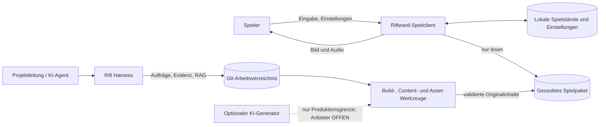
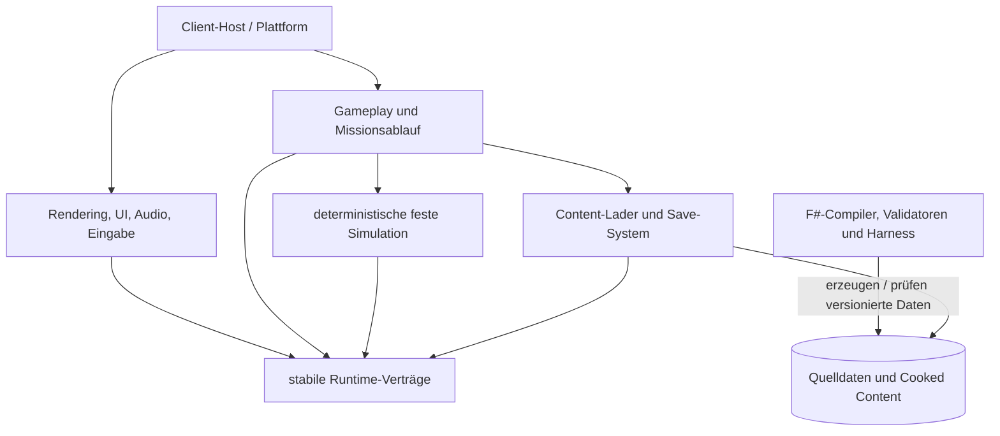

# Architektur und technische Leitplanken

Dieses Dokument beschreibt den beabsichtigten Systemzuschnitt. Bestätigte Technikentscheidungen stehen ausschließlich in den ADRs; noch zu messende oder fachlich zu entscheidende Punkte bleiben `OFFEN`.

## Systemkontext

Project Riftward besteht aus einem offline lauffähigen Einzelspieler-Client und einer davon getrennten Produktionsumgebung. Der ausgelieferte Client benötigt weder Konto noch Cloud-Dienst. KI-Dienste dürfen nur in der Produktion eingesetzt werden und werden niemals Runtime-Abhängigkeit.

## Schichten und Abhängigkeitsrichtung

- Simulation und Gameplay kennen keine SDL3-, bgfx- oder Betriebssystemtypen.
- Darstellung konsumiert Simulations-Snapshots und erzeugt Spielerbefehle; sie verändert den Weltzustand nicht direkt.
- Quelldaten und Rohassets gelangen nie ungeprüft in das Runtime-Paket.
- Offline-Werkzeuge dürfen mehr Komfort und JIT verwenden; der Clientkern bleibt AOT-/Trimming-freundlich.

## Komponenten

| Komponente | Verantwortung | Hauptschnittstellen / Daten | Sensible Daten | Status |
|---|---|---|---|---|
| Client-Host | Prozessstart, Lebenszyklus, Plattformwahl, Fehlergrenze, Taktung | eigene kleine C#-Verträge; Runtime-Konfiguration | lokale Pfade, Diagnoseprotokolle | ENTSCHIEDEN im Grundsatz |
| Plattform-Layer | Fenster, Eingabe und Plattformintegration | SDL3 über kleine `LibraryImport`-Wrapper | keine Konten; nur lokale Eingaben | ENTSCHIEDEN, ADR 002 |
| Render-Frontend | szenenbezogene Draw-Daten, LOD, Culling, Instancing, Beleuchtung und Qualitätsstufen | eigene Render-API zu bgfx; D3D11/OpenGL 3.3/Metal | keine | ENTSCHIEDEN, ADR 002 |
| Audio-Layer | Musik-, Umgebungs- und Effektwiedergabe mit Prioritäten | SDL3-Core-Audio oder SDL3_mixer | keine | OFFEN bis Audio-Spike |
| Simulation | fester Tick, Akteure, Befehle, Kampf, Wirtschaft, Navigation, Fog of War und Zustands-Hashes | reine Datenverträge, Seed und geordnete Befehle | keine | ANGENOMMEN |
| Gameplay / Mission | Helden, Fähigkeiten, Ausrüstung, Aufgaben, Dialoge, Entscheidungen, Basis und Missionsregeln | versionierte Content-Definitionen und Simulationsereignisse | keine | ANGENOMMEN |
| Präsentation / UI | Kamera, Auswahl, Befehlsfeedback, HUD, Menüs, Untertitel und Minimap | lesbare Snapshots; semantische Aktionen statt Gerätescancodes | Eingabebelegung lokal | ANGENOMMEN |
| Content-Lader | validierte, gecookte Definitionen und Assets laden; Handle-/ID-Auflösung | read-only Spielpaket mit Schema- und Paketversion | keine | ANGENOMMEN; Paketformat OFFEN |
| Save-System | atomar speichern/laden, Version prüfen, Korruption kontrolliert melden | lokaler Spielstand gemäß `DATENMODELL.md` | Spielverlauf, Einstellungen | ANGENOMMEN; Serialisierungsformat OFFEN |
| Entwicklungs-Telemetrie | Frame-, Tick-, Allokations-, Agenten-, Draw-, RAM-/VRAM- und Streamingwerte | maschinenlesbare lokale Messartefakte | Geräte-/Pfadangaben minimieren | ANGENOMMEN |
| Rift Harness | Runs, Hashkette, BM25-RAG, Zitate und Prüfevidenz | `.ai/`-Verträge und CLI aus `HARNESS.md` | Prompts/Logs können Secrets enthalten und werden bereinigt | ENTSCHIEDEN, ADR 003 |
| Content-/Asset-Pipeline | Quelldaten validieren, Originalassets normalisieren, LOD/Material/Rig prüfen und cooken | Asset-Manifeste, Hashes, Blender-/CLI-Artefakte | optionale Provider-Credentials außerhalb des Repos | ANGENOMMEN |

## Technische Entscheidungen

| Thema | Festlegung | Quelle | Status |
|---|---|---|---|
| Runtime und Sprachen | .NET 10 LTS; C# für Host, Interop und Hotpaths; F# für Harness, Compiler und Validatoren | ADR 001 | ENTSCHIEDEN |
| Release-Modus | Native AOT und selbstenthaltene CoreCLR-Builds messen; pro Zielsystem nativ bauen | ADR 001 | ENTSCHIEDEN als Auswahlverfahren, Ergebnis OFFEN |
| Fenster / Eingabe / Plattform | SDL3 | ADR 002 | ENTSCHIEDEN |
| Rendering | bgfx; Windows D3D11, Linux OpenGL 3.3, macOS Metal; Vulkan nur optional nach Messung | ADR 002 | ENTSCHIEDEN |
| Audio | Spike zwischen SDL3-Core-Audio und SDL3_mixer; nur benötigte Decoder ausliefern | ADR 002 | OFFEN |
| Persistenz | lokale versionierte Saves, Einstellungen und Checkpoints; keine Runtime-Datenbank | Anforderungen F-005/F-006 | ANGENOMMEN; Binär-/Textformat OFFEN |
| Produktion | lokales F#-Harness, JSONL-Ereignisse und BM25-RAG; kein Pflicht-Cloud-Dienst | ADR 003 | ENTSCHIEDEN |
| Performancebeweis | Budgets bleiben Hypothesen bis zum Release-nahen Lauf auf realer Referenzhardware; isolierte Baselines plus integrierter Repräsentativitätsnachweis | ADR 006 | ENTSCHIEDEN |
| Sprachrollen | C# für ausgelieferte Runtime; F# für typisierte Offline-Spezifikation, Compiler, Referenzmodelle und Verifikation; Python nur optionaler untrusted Offline-Adapter | ADR 001, ADR 006 | ENTSCHIEDEN |
| Integration | Arbeitsbranch → Pull Request → verpflichtende Gates → Squash-`main`; kein agentischer Direkt-Push auf `main` | ADR 006 | ENTSCHIEDEN |
| Distribution | eigenständige Pakete für Windows x64, Linux x64 und macOS arm64 | NF-006 | ENTSCHIEDEN im Ziel; konkrete Paketform/Stores OFFEN |
| Authentifizierung | kein Konto, keine Rollen und keine Bezahlung im Spielclient | NF-004 / MVP-Grenze | NICHT ZUTREFFEND |

## Laufzeitverträge

### Simulation und Darstellung

- Die Simulation läuft für den Vertical Slice mit 20 Hz gemäß `PERFORMANCE_BUDGET.md`; Rendering ist entkoppelt und darf interpolieren.
- Spieleraktionen werden als validierte, tickbezogene Befehle übergeben. Direkte UI-Mutation an Simulationsobjekten ist verboten.
- Gleicher Datenstand, Seed und dieselbe geordnete Befehlsfolge müssen innerhalb der noch festzulegenden Numerik-/Plattformtoleranz denselben fachlichen Zustand erzeugen. Numerik und exakter Hashvertrag werden im Technik-Spike festgelegt.
- Frame- und Simulationsbudgets aus `PERFORMANCE_BUDGET.md` sind API-Anforderungen: unbeschränkte Arbeit, versteckte Allokation und synchrones Rohasset-Laden in Hotpaths sind nicht zulässig.

### Native Grenze

- Der native Interop-Layer ist klein, zentral und durch ABI-Smoke-Tests abgedeckt.
- Native Handles werden nicht als Domänen-IDs verwendet; Besitz und Freigabe jedes Handles sind explizit.
- Fehlercodes und native Logs werden an einer Prozessgrenze in kontrollierte Fehlerobjekte übersetzt.
- Versions- und Commit-Hashes von SDL3, bgfx sowie deren nativen Unterabhängigkeiten werden gepinnt und in Build-Artefakten festgehalten.

### Content und Persistenz

- Der Client liest nur validierte Cooked-Assets und versionierte Definitionen; Source-Assets bleiben Produktionsdaten.
- Content-Verweise erfolgen über stabile IDs, nie über UI-Namen oder zufällige Dateisystemreihenfolge.
- Unbekannte Pflichtfelder, fehlende Referenzen oder Hashfehler blockieren das Paket beim Build. Laufzeitfehler werden ohne Absturz bis zum Hauptmenü gemeldet, sofern sicheres Fortsetzen möglich ist.
- Spielstände werden zunächst in eine temporäre Datei geschrieben, validiert und dann atomar ersetzt. Der letzte gültige Stand wird bei einem fehlgeschlagenen Schreibvorgang nicht überschrieben.
- Save-Migrationen sind explizite, getestete Schritte; stilles Verwerfen unbekannter Daten ist unzulässig.

## Produktions- und Vertrauensgrenzen

| Grenze | Vertrauensannahme | Pflichtmaßnahmen |
|---|---|---|
| Eingabegerät → Client | untrusted | Wertebereiche, Zustände und Belegungen validieren; keine Eingabe als Pfad/Befehl ausführen |
| Cooked Package → Client | nur nach Build-Gates vertrauenswürdig | Schema, Version, Referenzen, Größen und Hashes prüfen |
| Save/Settings → Client | untrusted und potenziell beschädigt | Größenlimits, Versionsprüfung, kontrollierte Migration, verständliche Fehlermeldung |
| C# → native Bibliotheken | ABI-kritisch | gepinnte Builds, zentrale Wrapper, Lebensdauerregeln, Plattform-Smokes |
| Rohasset/Generator → Pipeline | untrusted | Quarantäne, Provenienz-, Lizenz-, Ähnlichkeits- und technische Prüfung |
| RAG-Dokument → Agent | Daten, niemals Instruktion | Allowlist, Zitate/Hashes, keine Rechteausweitung, Konflikte sichtbar machen |
| optionaler KI-Dienst → Produktion | externer, austauschbarer Anbieter | keine Projekt-Secrets in Prompts; Credentials nur über lokale/CI-Secrets; Output bleibt Quarantäne |

Mods, Multiplayer, Runtime-Skripting und das Laden nicht signierter Fremdpakete gehören nicht zum Vertical Slice. Dafür werden daher noch keine Schnittstellen freigehalten, die AOT, Sicherheit oder Determinismus schwächen.

## Betrieb und Auslieferung

- **Umgebungen:** lokale Entwicklung; native CI-/Build-Runner je Zielbetriebssystem; hardwaregebundene Benchmark-Rechner; veröffentlichte Offline-Clientpakete.
- **Build:** Locked Restore und gepinnte native Quellen. Release-Builds werden auf dem jeweiligen Zielbetriebssystem erzeugt; Cross-OS-Publishing gilt nicht als Freigabenachweis.
- **Beobachtbarkeit:** Entwicklungs- und Benchmark-Builds schreiben maschinenlesbare lokale Metriken. Spielertelemetrie ist standardmäßig aus und erfordert vor Einführung eine eigene Produktentscheidung.
- **Fehlerbehandlung:** keine versteckte Netzwerkwiederholung. Ein Clientfehler darf keine Save-Datei zerstören; ein Produktionslauf wird mit Evidenz und Fehlerklasse abgeschlossen.
- **Sicherung:** Git versioniert Spezifikation, Code, kuratiertes Gedächtnis und kleine Manifeste. Große Assets/Traces benötigen einen später festzulegenden hashadressierten Artefaktspeicher.
- **Skalierungsgrenze:** Der Vertical Slice wird gegen die Szenen- und Speicherbudgets aus `PERFORMANCE_BUDGET.md` gebaut; Änderungen erfordern reproduzierbares Profil und dokumentierte Freigabe.

## Architekturprüfungen vor dem Vertical Slice

- Dreiplattform-Smoke: Fenster, Eingabe, Shaderdreieck, Audio-Spike und kontrolliertes Beenden.
- Runtimeprojekte publizieren mit aktivierten AOT-/Trimming-Analysen ohne pauschal unterdrückte Warnungen.
- Gameplay-/Simulationsprojekte referenzieren keine SDL3-/bgfx-Interoptypen.
- Ein fester Replay erzeugt plattformübergreifend vergleichbare Zustands-Hashes; zulässige Numerikabweichungen müssen vorab spezifiziert sein.
- Ein beschädigtes Paket und ein beschädigter Save werden abgewiesen, ohne den letzten gültigen Stand zu verlieren.
- `BENCH-EMPTY` und anschließend alle Pflicht-Benchmarks liefern die in `PERFORMANCE_BUDGET.md` definierten Messfelder.
