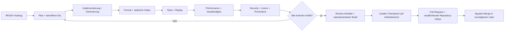

# KI-Automation und Produktionssystem

## Ziel

KI soll den überwiegenden Teil der Produktion ausführen können: Spezifikation verfeinern, Code und Tests erstellen, Assets erzeugen und cooken, Benchmarks auswerten, Fehler eingrenzen und Dokumentation aktualisieren. Automatisierung ersetzt dabei keine prüfbaren Verträge.

## Autonome Arbeitsschleife



## Geschützte GitHub-Integration

- Agenten besitzen keinen allgemeinen GitHub-Publisher und pushen niemals
  direkt auf `main`.
- Ein lokaler, repo-gebundener Integrator akzeptiert nur den festgelegten
  Arbeitsbranch und genau dieses Repository.
- Er öffnet oder aktualisiert einen Pull Request und wartet auf alle
  verpflichtenden Checks. Rote oder fehlende Gates, Konflikte, ein schmutziger
  Arbeitsbaum und abweichende Bäume blockieren den Merge fail-closed.
- Ein begrenzter frischer Reviewlauf darf belegte Integrationsfehler
  reparieren. Wiederholtes Scheitern beendet die Automation sichtbar.
- Erst nach Squash-Merge und identischem freigegebenem Baum werden lokale Refs
  neu verankert. Dadurch bleibt `main` jederzeit der abnehmbare und öffentlich
  demonstrierbare Stand.

Der Integrator verwaltet keine anderen Repositories und erweitert weder
Agentenrechte noch Modellzugriffe. Details und Begründung stehen in ADR 006.

## Öffentliches Projektcockpit

README und GitHub Pages sind Projektionen derselben eingecheckten Wahrheit,
kein zweites Backlog. Der Pages-Workflow läuft bei jedem `main`-Push, per
manueller Auslösung und planmäßig alle 15 Minuten. Er löst `origin/main`
zunächst über die GitHub-API auf, checkt ausschließlich diesen exakten Commit
aus und prüft Commit, Tree und Ref unmittelbar vor der Veröffentlichung erneut.
PR-, Fork- und `autopilot/live-wip`-Inhalte werden nie ausgeführt. Sie dürfen
nur als streng geschlossene öffentliche Daten erscheinen.

Der öffentliche Status trennt sechs Aussagen:

- `observation`: Zeitpunkt und Altersklasse der öffentlichen Beobachtung;
- `accepted`: der exakte `main`-Commit/Tree und wirklich akzeptierte Tasks;
- `candidates`: offene, schema- und gategebundene Kandidaten;
- `continuity`: ein WIP-Snapshot, ausdrücklich kein akzeptierter Fortschritt;
- `activity`: nur ein frisches, allowgelistetes Betriebssignal;
- `claims`: enge Aussagen darüber, was das Projekt bereits und noch nicht
  belegt.

Eine Beobachtung ist bis 30 Minuten `current`, danach `stale` und ab sechs
Stunden `offline`. Der Browser darf einen Zustand nur anhand der
gleichoriginären HTTP-Zeit abwerten, nie anhand einer frei verstellbaren
Client-Uhr aufwerten. Fehlende API-, HTTP-, Gate-, Provenienz- oder
Reconciliation-Evidenz führt zu `unknown` beziehungsweise verhindert ein
neues Deployment. WIP, Agentenaktivität, Commitzahl und Orchestratorverfügbarkeit
werden niemals automatisch als produktiver Fortschritt gezählt.

Historische Promotionsbelege und ihre heutige unabhängige Nachprüfung bleiben
getrennte Evidenzklassen. Ein vorhandener PR-/CI-Receipt allein setzt keinen
Task auf `DONE`. Dafür müssen Backlog, Taskmanifest und ein live an den
aktuellen Main-Baum gebundener Reconciliation-Verdict exakt übereinstimmen.
Historisch nicht öffentlich nachweisbare Rollentrennung bleibt auch nach einer
retrospektiven Prüfung ausdrücklich unbekannt.

## Stabile Autopilot-Identitäten

Neue Agentencommits verwenden die eingecheckte Rollenpolicy unter
`.ai/policies/commit-role-policy.json`: `Riftward Planner Autopilot`,
`Riftward Builder Autopilot`, `Riftward Reviewer Autopilot`,
`Riftward Repair Autopilot` oder `Riftward WIP Autopilot`. Pflichttrailer
binden Rolle, Task, Ausgangscommit und Ausgangstree. Reviewer ergänzen den
exakt geprüften Commit/Tree und `Independent-Review`.

Auf Pull Requests prüft `./scripts/rift.sh verify` diese Policy zusätzlich
gegen den tatsächlichen, aus dem GitHub-Ereignis gelesenen Base-/Head-Bereich:
jeder neue Checkpoint muss genau einen Parent besitzen und seine
`Source-Commit`-/`Source-Tree`-Trailer daran binden; ein Reviewer muss exakt
den letzten Kandidatencommit und dessen Tree prüfen. Der von GitHub erzeugte
Squash-/Promotionscommit bleibt davon getrennt und wird über PR-, Tree-,
Pflichtcheck- und Reconciliation-Evidenz nachgewiesen.

Ändert ein Commit `.ai/public-status-v3.json`, muss er zusätzlich
`Public-Status-Blob: <Git-Blob-OID>` tragen. Der öffentliche Beobachter liest
die Datei aus genau diesem Commit und akzeptiert sie nur, wenn Trailer,
GitHub-Content-SHA und lokal berechneter Blob-OID identisch sind. Ein
unveränderter, weitergetragener oder generischer WIP-Snapshot kann damit kein
frisches Aktivitätssignal vortäuschen.

Die Projektleitung darf Promotionscommits weiterhin mit der verifizierten
Koschnag-No-Reply-Identität ausführen. Eine andere Zeichenkette im Autor-Feld
beweist keine andere Person oder einen anderen Prozess; sie ist öffentliche
Rollenprovenienz. Bestehende Historie wird nicht umgeschrieben. Die Policy gilt
nur für neue Commits ab der jeweiligen Task-Baseline.

## Einheitlicher Befehlsvertrag

Diese Aufgaben werden früh im Repository bereitgestellt und bleiben die einzige öffentliche Automationsschnittstelle:

- `bootstrap`: gepinnte Werkzeuge und Abhängigkeiten vorbereiten
- `build`: Development-Build der aktuellen Plattform
- `fmt`: Formatierung anwenden
- `lint`: Format, Toolchain-/Lizenz-/ISA-Prüfung und Daten-Schemas nur prüfen
- `test`: deterministische Tests ohne Netzwerk ausführen
- `assets-check`: Roh- und Cooked-Assets prüfen
- `plattformsmoke`: nativen linux-x64-Smoke (Fenster, GL-3.3-Dreieck, maschinenlesbarer Report) ausführen
- `effizienzbaseline`: Effizienzlauf mit Budgetgate (Startzeit, RSS, p99, Allokationen, Draw-Aufrufe) und Report ausführen
- `bench --scenario bench-empty --report PFAD`: deterministische leere Benchmarkszene (T-020) mit maschinenlesbarer Telemetrie nach NF-007 und fail-closed Budgetgate ausführen; unbekannte oder noch nicht implementierte Szenarien (`bench-army`/`-battle`/`-base`/`-path`/`-load`) schlagen mit Exitcode 25 fehl und erzeugen keinen Report. Läufe auf dem Entwickler-PC sind diagnostische Baseline gemäß Q-OPS-001; Profilbestehen entsteht nur durch deklarierte Referenzklassenbindung bei benannten Referenzrechnern
- `bench --scenario bench-sim --report PFAD`: deterministische headless Simulationsbaseline (T-021) mit festem 20-Hz-Tick und genau 250 vollständig simulierten mobilen Testagenten nativ auf linux-x64 ausführen; rein CPU-seitig ohne Fenster/Renderer, Report nach NF-007 mit Zustands-Hashkette, Budgetgate fail-closed gegen 8 ms Ziel/16 ms harte Grenze je Tick sowie die in `docs/SIMULATIONSVERTRAG.md` fixierte Allokationsgrenze je warmem Tick; dieselben Szenario-/Profil-Ehrlichkeitsregeln wie bench-empty
- `bench --scenario bench-representative --report PFAD [--capture-frame PFAD]`: integrierten deterministischen Belastungsframe (T-023) nativ auf linux-x64 ausführen — 350 sichtbare instanzierte Einheiten mit 48-Bone-Skinningpfad (davon genau die 250 vollständig simulierten Agenten), Graybox-Landschaft, eine Sonne plus vier lokale Schattenlichter mit aktiven Schattenpaessen, Partikelspitze bis 5000; Report Schemaversion 3 nach NF-007 mit Kompositionsbindung, Zustands-Hashkette und fail-closed Budgetgate ausschließlich gegen dokumentierte Grenzwerte; das opt-in `--capture-frame` schreibt nach dem Messfenster genau einen lokal gebundenen Einzelabgriff mit Aussagegrenze „Graybox-Lastbelegung“ (niemals Gameplay-/Atmosphären-/Shipping-Beleg); die übrigen Pflichtszenarien (`bench-army`/`-battle`/`-base`/`-path`) schlagen weiterhin mit Exitcode 25 fehl und erzeugen keinen Report; dieselben Profil-Ehrlichkeitsregeln wie bench-empty
- `soak --scenario soak-replay --report PFAD [--diagnostic-accelerated [--horizon-ticks N]] [--reference-out PFAD]`: deterministischen Zuverlässigkeits-Replay-Soak (T-022) nativ auf linux-x64 im bestehenden Host ausführen — rein CPU-seitig ohne Fenster/Renderer, SDL3-/bgfx-Artefakte werden nicht geladen. Evidenzmodell nach Soakvertrag `docs/SOAKVERTRAG.md` V2 (Projektleitungsentscheidung 2026-08-25): NF-002 wird durch mindestens drei unabhängige Fresh-Prozess-Wiederholungsläufe über den kompletten skriptierten Planhorizont des Simulationsvertrags V1 (576000 Messsticks, genau 250 vollständig simulierte Agenten) in Release-naher Konfiguration nachgewiesen; die beschleunigte Taktung ist dafür zulässig, weil die Pacing-Unabhängigkeit durch Test belegt ist. Jeder Lauf entscheidet fail-closed ausschließlich gegen die absoluten Grenzwerte des Soakvertrags (doppelte Speicherschwellwertform mit Konsistenzbedingung, Fortschritts-Watchdog, strenge Per-Tick-Allokation gemäß Simulationsvertrag §5, Golden-Fixture-Kettenintegrität) und ist je Report als Evidenzeinheit (`execution.evidenceUnit`) markiert; horizontverkürzte Läufe (`--horizon-ticks`) bleiben rein diagnostisch. `--reference-out` ist auch bei vollständigem Horizont stets eine eigenständig markierte diagnostische Referenzemission und niemals Evidenz; erst ein separater Fresh-Prozess-Lauf darf die versionierte Fixture bestätigen. Das Restrisiko des nicht nachgewiesenen zusammenhängenden Achtstunden-Echtzeitbetriebs ist vertraglich ausgewiesen; der frühere autoritative Achtstundenlauf wurde absichtlich abgebrochen und darf nicht neu gestartet werden. Die fensterweise Tickzeitdrift ist gatefrei diagnostisch, die tolerierte Benchmarkstreuung (Q-TEC-010) bleibt offen. Unbekannte oder noch nicht implementierte Soakszenarien brechen mit Exitcode 32 ab und erzeugen keinen Report; Abschnitt-0-Kalibrierläufe laufen über `soak --scenario soak-calibration` (rein diagnostisch). Läufe auf dem Entwickler-PC sind diagnostische Baseline gemäß Q-OPS-001; Pflichtprofile bleiben `NOT-MEASURED`
- `savecheck --report PFAD [--work VERZ] [--seed N] [--plan-ticks N] [--safe-tick N] [--sample-interval-ticks N] [--lock DATEI]`: versionierten, atomaren Save/Lade-Nachweis (T-031) nativ headless auf linux-x64 im bestehenden Host ausführen — rein CPU-seitig ohne Fenster/Renderer/Netzwerk, SDL3-/bgfx-Artefakte werden nicht geladen. Der Lauf folgt dem versionierten Savevertrag `docs/SAVEVERTRAG.md` V1: Simulation des festen Vertragsplans, Snapshot am sicheren Tick, atomares Slotprotokoll mit vollständiger Validierung vor Ersetzung, Rückladen in einen frischen Prozesszustand und byteidentischer Vergleich der Hashkettenfortsetzung (`fnv1a64-canonical-chain-v1`) gegen einen unterbrochenen Referenzlauf über mindestens die Hälfte des Planhorizonts. Die Prüfklassenmatrix umfasst Roundtrip-Byteidentität über Fresh-Prozesse, Fremdseed-Sensitivität, Fault-Injection je Schreibphase, die unterscheidbare Korruptionsmatrix gemäß DATENMODELL-Fixturliste, Migrationsregeln (strikte Monotonie, keine erfundene Migration), Metadatenabgrenzung sowie Vertrauensgrenzproben; der Größen-Sanity-Schwellwert entsteht fail-closed aus mindestens zwei übereinstimmenden Kalibrierläufen als Vielfaches im Band 2× bis 16×. Snapshotgröße ist Gategröße; alle Dauern sind rein diagnostisch (`gateCoupled=false`). Verletzungen ergeben Exitcode 33 bei trotzdem geschriebenen, klar als nicht bestanden markierten Report; ein unvollständiger Lauf ergibt Exitcode 34 mit einem als keine Evidenz markierten Teilreport. Läufe auf dem Entwickler-PC sind diagnostische Baseline gemäß Q-OPS-001; Pflichtprofile bleiben `NOT-MEASURED`
- `kommandoschleife --scenario kommando-graybox --input-script PFAD --seed N --report PFAD [--interactive [--auto-exit-at-horizon]] [--capture-frame PFAD] [--warmup-ticks N] [--horizon-ticks N] [--lock DATEI]`: interaktive Graybox-Kommandoschleife (T-032, hybrid erweitert durch T-033) nativ auf linux-x64 im bestehenden Host ausführen — headless rein CPU-seitig ohne Fenster/Renderer/Netzwerk (native Artefakte werden nicht geladen) oder fensterpflichtig mit `--interactive` über denselben Pipelinepfad. Der Sitzungskern bildet validierte Intents ausschließlich auf die unveränderte Kernbefehlsfläche (`SimCommandKind.GroupMoveToZone`) ab und folgt dem Kommandovertrag `docs/KOMMANDOVERTRAG.md` V1 samt Modus-Scoping (Abschnitt 12) und dem Modevertrag `docs/MODEVERTRAG.md` V1. Eingabeskripte liegen als `graybox-input-script-v1` (Legacy-Vier-Verbmenge, byteidentisch gültig) oder `graybox-input-script-v2` (Obermenge mit `steer <zoneIndex>` und `switch`) vor; kontextfalsche Intents sind grammatisch gültig und werden pipeline-seitig mit unterscheidbaren Dispositionen abgewiesen. Der Report (Schemaversion 2) bindet Skript-/Planhashes, Zustands-Hashketten, Tickzeit-, Allokations- und Reaktionsticksverteilung, den Modussitzungsblock (Wechselprotokoll je Grenze inklusive Heldenstatus, Kontextabweisungszähler, Lenk-Dedupe, Titel-HUD-Bindung, Wechselreaktionsverteilung) sowie den Modevertrag, und das Gate entscheidet fail-closed ausschließlich gegen die dokumentierten absoluten Grenzwerte (16 ms hart/8 ms Ziel je Tick, 0 Bytes Allokation je warmem Tick, Reaktion ≤ 3 Ticks hart/≤ 2 Ziel, Wechselreaktion ≤ 3 Ticks hart/≤ 2 Ziel — ohne wirksamen Wechsel ausdrücklich nicht auswertbar mit Grund, keine Laufzeitshaderkompilierung, headless Kettenkonsistenz). Im Interaktivmodus wechselt `mode-switch` (Standard Tab) zwischen strategischem RTS-Modus (unveränderte T-032-Bedienung) und persönlichem Heldenmodus (55°-Verfolgungskamera mit am Weltrand eingepasstem 16:9-Bodenabdruck und dokumentiertem Fokus-/Randkompromiss, richtungsgelenkter Lenkung über die Pan-Tasten, Held-/Modus-Badge, Titel-HUD `Riftward Graybox — Modus: … — Heldenzone: …`); strategische Auswahlglyphen bleiben beim Wechsel als Zustand erhalten, werden im persönlichen Modus zugunsten des Helden-/Landmarkenkanals ausgeblendet und erscheinen beim Rückwechsel unverändert wieder. Ohne nutzbares Display bricht der Interaktivmodus kontrolliert mit Code 19 ab. `--auto-exit-at-horizon` ist ein ausschließlich interaktives Opt-in für unbeaufsichtigte Display-Gates: Nach dem vollständig gerenderten Messhorizont läuft der Prozess kontrolliert in Capture und Reportabschluss, während der normale interaktive Pfad unverändert bis zu einem echten Quit-Ereignis offen bleibt; nur dieser begrenzte Gatepfad löst die Present-VSync-Bindung, damit ein verdecktes Wayland-Surface den unverändert wanduhrgebundenen 20-Hz-Simulationstakt nicht drosselt. Das opt-in `--capture-frame` erzeugt nach dem Messfenster genau zwei hashgebundene Einzelabgriffe (`-strategisch`/`-persoenlich`, je einer pro Modus über demselben Weltzustand am selben Tick) mit der Aussagegrenze „Graybox-Zustandsbelegung"; der rein lokale strategische Evidenzabgriff hält den Vertragshelden mit unverändertem Nickwinkel und höchstens dem Sitzungszoom im darstellseitig eingepassten Frustum, ohne Sitzungskamera oder Welt zu mutieren. Unbekanntes Szenario oder malformiertes Skript schlägt mit Exitcode 37 ohne Report fehl; Gateverletzungen ergeben 35, ein unvollständiger Lauf 36 ohne Evidenz, ein fehlgeschlagener opt-in Abgriff 38 mit `captured=false`; dieselben Profil-Ehrlichkeitsregeln wie bench-empty
- `kommandoschleife ... --exploration` aktiviert den sitzungslokalen Erkundungsauftrag T-034 über exakt demselben Pipelinepfad. Ohne Opt-in bleibt der vorstehende Bestandsreport bei Schemaversion 2 und enthält keinen Erkundungsblock; mit Opt-in trägt der rein additive Report Schemaversion 3 und den Pflichtblock `explorationSession`. Dieser bindet relational fail-closed die kanonisch begehbaren Anker, eindeutige persönliche Besuche sowie übereinstimmende Protokoll-/Fortschritts-/Abschlusswerte und außerdem die feste, seedunabhängige Landmarkenmenge (eine begehbare Graybox-Landmarke je Vertragszone), das persönliche Aufsuchprotokoll (`evaluationBoundaryTick`, `zoneIndex`, `mode`, `visitOrder`), Fortschritt und Abschluss (`visitedCount`/`landmarkCount`/`completed`, jeweils nicht gategekoppelt), die maschinenlesbare Nichtpersistenzaussage `session-local-not-persisted-v1` sowie ehrliche HUD-/Landmarkenkanal-Ausweise. Strategische Rahmenwahl und bestehende Gruppenbewegung mobilisieren die Armee; eine Landmarke registriert nur die physische Anwesenheit des Vertragshelden in ihrer Zone an einer persönlichen Vorgrenze. Die Beobachtung erzeugt nie einen Kernbefehl, verändert weder Simulation noch Hashkette und führt keine neue Exitcodebedeutung ein. Headless und vorzeitig beendete Interaktivläufe weisen die fensterpflichtigen visuellen Kanäle mit Grund als nicht gemessen aus; erst ein abgeschlossenes Interaktivfenster bindet sie messend. Interaktiv ergänzt der Titel `Erkundung: n/m` und unterscheidet unbesucht/besucht über echte Diamantform plus Farbe am festen Anker und als heldennahes Echo der aktuellen Zone. Der vollständige Vertrag einschließlich Playtestkriterien und Rückrollwegen steht in `docs/ERKUNDUNGSVERTRAG.md` V1.
- `kommandoschleife ... --decision` aktiviert den sitzungslokalen Entscheidungsschritt T-035 über exakt demselben Pipelinepfad; `--decision` ohne `--exploration` ist eine Usage-Fehlanwendung (bestehende Bedeutung 2). Die Skriptgrammatik `graybox-input-script-v3` ist eine strikte Obermenge von v2 mit den beiden parameterlosen, sitzungsseitigen Aktionen `choose-a`/`choose-b`; unter v1-/v2-Köpfen bleiben sie `UnknownAction` (Exit 37), und Legacy-Skripte bleiben byteidentisch gültig. Mit Opt-in trägt der rein additive Report Schemaversion 4 und den Pflichtblock `decisionSession`: Angebotsöffnung genau an der ersten Erkundungsabschlussgrenze (einmal je Sitzung; ohne Abschluss der ehrliche Grund `exploration-not-completed-within-run`), die zwei Optionszonen als reine Funktion des Aufsuchprotokolls (zuerst/zuletzt registrierte Landmarke; fail-closed Vertragsfehler `decision-offer-insufficient-distinct-zones` im Degenerationsfall), die Wahl in fester Auswertungsordnung (`decision-not-activated`, `decision-choose-before-offer`, `decision-choose-in-strategic-mode`, `decision-choose-after-decision`) nur im persönlichen Modus an offenes Angebot, die gewählte Zone als einmaliges Folgeziel mit persönlicher Ankunftskopplung (`boundary-arrival-personal-mode-only-v1`), die Nichtpersistenzaussage `decision-session-local-not-persisted-v1` sowie ehrliche HUD-/Folgezielkanal-Ausweise; sämtliche Felder sind `gateCoupled=false` und relational fail-closed gebunden (gewählte Zone ist Angebotszone, Folgenzone ist Wahl, Ankunft an oder nach der Wahl, Abschluss und Ankunftsgrenze konsistent, ohne Angebot keine Entscheidung/Folge). Die Entscheidungsschicht erzeugt nie einen Kernbefehl und verändert nie Simulation oder Hashkette: Ein A/B-Wahlpaar mit identischen Kernintents erzeugt byteidentische Ketten bei unterscheidbaren Entscheidungsreports. Interaktiv ergänzt der Titel die Zustände ` — Entscheidung: –`, ` — Entscheidung: A=Z<a> B=Z<b>`, ` — Folgeziel: Z<f>` und ` — Folgeziel: Z<f> abgeschlossen`, und der gewählte Anker trägt ab der Wahl den unterscheidbaren dreistufigen violette Folgezielmarker (NF-005, Form plus Farbe; Wahl über die Zifferntasten 1/2 als frei belegbare Keymap-Aktionen `choose-a`/`choose-b`). Es entstehen keine neuen Exitcodebedeutungen. Der vollständige Vertrag einschließlich Alternativen, Playtestkriterien und Rückrollwegen steht in `docs/ENTSCHEIDUNGSVERTRAG.md` V1.
- `kommandoschleife ... --pressure` aktiviert die sitzungslokale Druck- und Neustartschicht T-036 über exakt demselben Pipelinepfad; `--pressure` ohne `--decision` ist eine Usage-Fehlanwendung (bestehende Bedeutung 2), die Skriptgrammatik bleibt unverändert (v1/v2/v3 byteidentisch gültig), und es entstehen keine neuen Exitcodebedeutungen. Mit Opt-in trägt der rein additive Report Schemaversion 5 und den Pflichtblock `pressureSession`: die entscheidungsgekoppelte Fensterauslösung (`decision-coupled-window-v1`, erste Instanz genau an der Entscheidungsgrenze, weitere an der erneut wirksamen Wahl nach Wiederauffrischung; ohne erreichten Entscheidungsstand die ehrlichen Gründe `decision-not-reached-within-run` bzw. `decision-offer-open-without-choice-within-run`), die fixierte deterministische Zeitbasis (`fixed-deterministic-tick-window-v1`, `windowLengthTicks` = 600 Vorgrenzen = 30 s bei 20 Hz; die Ankunft an der Ablaufgrenze selbst ist die letzte Gelegenheit), der definierte Fehlschlag mit Ursache `window-expired-without-arrival` an der Ablaufgrenze (`defined-failure-automatic-reopen-v1`) mit deterministischer Angebots-Wiederauffrischung genau an der nächsten Vorgrenze auf Basis der autorisierten additiven Zyklus-Präzisierung des Entscheidungsvertrags V2 (`session-local-cycle-restart-v1`, unveränderte Optionsableitung, eindeutige Zykluszählung, kein Kernbefehl), die unveränderte T-035-Ankunftsregel als Erfolgswahrheit innerhalb des offenen Fensters (`unchanged-decision-arrival-within-window-v1`, Einmalabschluss je Zyklus), das Fensterprotokoll je Instanz (Instanz-/Zyklusnummer, Start-/Endgrenze, Endgrund, Ankunftsgrenze/-modus bzw. Ursache), die ehrlichen Endstatuswerte (`not-started`/`window-open`/`restart-pending`/`success`), die Nichtpersistenzaussage `pressure-session-local-not-persisted-v1` sowie ehrliche HUD-/Neustartkanal-Ausweise; sämtliche Felder sind `gateCoupled=false` und relational fail-closed gebunden (Instanz-/Zyklusgleichheit, Endgrenze an oder nach Startgrenze, Ursache nur mit Ablauf, Ankunft nur mit Erfolg und innerhalb der Instanzgrenzen, Wiederauffrischung genau an der nächsten Vorgrenze nach dem Fehlschlag, ohne wirksame Entscheidung keine Instanz). Die Druckschicht erzeugt nie einen Kernbefehl und ist nie Teil von Simulationszustand oder Hashkette: ein Zwilling ohne Aktivierung bleibt byteidentisch, ein Fremdseed ändert Start- und Endhash, niemals aber die Struktur des Druckprotokolls (reine Funktion aus Sitzungszustand, Modus-/Ankunftsgrenzen und Fensterinstanzen). Interaktiv ergänzt der Titel die Zustände ` — Druck: Zyklus <n> Rest <r>`, ` — Druck: Fehlschlag: Zeit abgelaufen` und ` — Druck: Erfolg`, und der Anker der Folgenzone des fehlgeschlagenen Zyklus trägt im Fehlschlags-/Neustartzeitraum die unterscheidbare zweistufige, klein-unten/groß-oben markierte Säule in warmem Rot (NF-005, Form plus Farbe). Der vollständige Vertrag einschließlich Alternativen, Playtestkriterien und Rückrollwegen steht in `docs/DRUCKVERTRAG.md` V1.
- `kommandoschleife ... --save-at-tick N` beziehungsweise `... --load-slot` aktiviert den headless Fortsetzungspfad T-037 über exakt demselben Pipelinepfad (Savevertrag `docs/SAVEVERTRAG.md` V2, Abschnitt 13.2); `--slot-dir VERZ` ist Pflicht, `--slot NAME` wählt den Slot (Standard `slot-interactive.rwsaved`), und die Flags schließen sich mit `--interactive` aus (bestehende Usage-Bedeutung 2). Der Speicherlauf spielt die unveränderte Skriptgrammatik bis zur Vorgrenze `N` innerhalb des Messfensters, schreibt Simulation plus additive Sitzungssektion (aktiver Modus samt schwebender Wechsel, Aufsuchprotokoll, Entscheidungsangebot/Wahl/Folge, Druckfenster/Zyklus) atomar in den Slot und endet; der Fortsetzungslauf ist ein frischer Prozess, der den Slot vollständig vor Aktivierung validiert (T-031-Prüfklassen uneingeschränkt für die Sektion, Aktivierungsgrenzen `foreign-world-id`/`foreign-seed`/`layer-activation-mismatch`), Welt und Sitzungsschicht wiederherstellt und dieselbe Skriptausführung ab der Ladegrenze fortsetzt. Die Fortsetzungskette ist ab der Ladegrenze byteidentisch zur unterbrochenen In-Prozess-Referenz und bindet als Bestandskriterium 5 fail-closed; die restaurierte Kettenwahrheit und die Fortsetzungsidentität sind rein additive, nicht gategekoppelte Felder des Pflichtblocks `continuation` der Schemaversion 6. V1-Slots laden unverändert mit ehrlicher, maschinenlesbarer Sitzungsleere; abgewiesene Ladungen enden kontrolliert mit Code 36 ohne neue Exitcodebedeutung; die Persistenzwahrheit der vier Sitzungsschichten ist save/load-fortsetzbar mit ausdrücklicher Replay-Ausnahme (`replay=not-continued`). Interaktiv speichert und lädt die frei belegbare Keymap-Familie über `save-slot` (Standard F5) und `load-slot` (Standard F9) mit `--slot-dir`; ohne Verzeichnis erhalten die Impulse eine kontrollierte, unterscheidbare Ablehnung, und nach dem Laden weist der Titel-HUD die wiederhergestellte Kettenwahrheit in beiden Modi ohne Tastendruck aus. Playtests prüfen die vorregistrierten Kriterien des Savevertrags Abschnitt 13.7; ohne Display bleiben Interaktivsmoke und Playtestausführung ausgewiesene Restpunkte mit kontrolliertem Code-19-Nachweis.
- `kommandoschleife ... --mission` aktiviert die sitzungslokale Abschluss- und Wiederholungsschicht T-039 über exakt demselben Pipelinepfad; `--mission` ohne `--pressure` ist eine Usage-Fehlanwendung (bestehende Bedeutung 2). Die Skriptgrammatik `graybox-input-script-v4` (Abschlussvertrag Abschnitt 3) ist eine strikte Obermenge von v3 mit der parameterlosen, sitzungsseitigen Aktion `repeat`; unter v1-/v2-/v3-Köpfen bleibt sie `UnknownAction` (Exit 37), und Bestandsskripte bleiben byteidentisch gültig. Mit Opt-in trägt der rein additive Report Schemaversion 7 und den Pflichtblock `missionSession`: den abgeleiteten Abschlusszustand als reine Funktion der bestehenden Schichtwahrheiten (`derived-completion-state-pure-function-v1` — Druckendstatus `success` des aktuellen Zyklus plus abgeschlossene Entscheidung plus abgeschlossene Erkundung; ohne Erfolg den ehrlichen Grund `no-cycle-success-within-run`), die beobachtete Abschlussgrenze der aktuellen Kette, die Kettenlaufzählung (beginnt bei 1), das Wiederholungsprotokoll je Eintrag (Vorgrenze, Disposition `applied`/`rejected-before-completion`, Kettenlaufstand), den Abweisungszähler und die versionierte Persistenzaussage (`mission-chain-run-counter-persisted-v1` — Kettenlaufzählung save/load-fortsetzbar über die additive Sektionsversion 2 des Savevertrags V3, abgeleitete Abschlusswahrheit ohne Persistenzbyte, ausdrückliche Replay-Ausnahme); sämtliche Felder sind `gateCoupled=false` und relational fail-closed gebunden (Abschluss nur nach dem Zykluserfolg der Schichten, Kettenlaufzählung beginnt bei 1 und erhöht sich je wirksamer Wiederholung um genau eins, abgewiesene Wiederholungen verändern sie nicht, Abweisungszähler entspricht der Protokollanzahl). Die wirksame Wiederholen-Aktion setzt an ihrer Vorgrenze die gesamte sitzungslokale Kette kontrolliert zurück (`full-chain-restart-including-visit-protocol-v1` — Aufsuchprotokoll samt Fortschritt, Entscheidungsangebot/Wahl/Folge, Druckfenster/Zyklus; der Sitzungsmodus, die Welt und die Simulation bleiben unverändert, kein Kernbefehl, kein Hashzustand, ADR 008), die neue Kette durchläuft Erkundung, Angebotsableitung aus dem neuen Protokoll (abweichende Aufsuchfolge kann zu abweichenden Optionen führen — Wiederholvarianz ohne Content), Wahl und Erfolg erneut; eine Wiederholung vor dem Abschluss wird mit der unterscheidbaren Klasse `mission-repeat-before-completion` abgewiesen und verändert nachweislich nichts. Interaktiv ergänzt der Titel das feste Segment ` — Auftrag: abgeschlossen` (title-hud-mission-completion-v1, NF-005-Zweikanal, Lesezeit ≤ 2 s) und zeigt nach dem Kettenneustart die neue Kette (Erkundung 0/6, kein Angebot, kein Fenster) ohne Tastendruck; die Wiederholen-Aktion ist über die frei belegbare Keymap-Aktion `repeat-mission` (Standard F7, Kommandovertrag Abschnitt 13) erreichbar, kontextfalsche Impulse erhalten die sichtbare UF-001-Fehlerzeile mit ihrer vertraglichen Kennung. Der vollständige Vertrag einschließlich Alternativen, Playtestkriterien und Rückrollwegen steht in `docs/ABSCHLUSSVERTRAG.md` V1.
- `security`: Secrets, Abhängigkeiten und Lizenzen prüfen
- `check`: alle nicht verändernden lokalen Gates ausführen
- `package [--output-dir VERZ] [--work VERZ] [--rid linux-x64]` beziehungsweise
  `package --verify ARCHIV.tar.gz`: versioniertes, checksumgebundenes
  linux-x64-Alphapaket (T-038) gemäß versioniertem Paketvertrag
  `docs/PAKETVERTRAG.md` V1 erzeugen oder prüfen — selbstenthaltener
  CoreCLR-Publish ohne AOT/Trimming, native Laufzeitartefakte mit
  artifact-hashgebundener Manifestbindung über die bestehende Host-Prüfung,
  Bestandsfixtures, deterministisch erzeugte Release Notes und
  Lizenz-/Attributionsmanifest, `package-manifest.json` mit Anker und
  Archiv-Sidecar; byteidentischer Doppelbau desselben Baums; unbekannte
  RIDs/Optionen schlagen mit Usage-Code 2 fehl, ein gescheiterter Bau mit 39,
  eine gescheiterte Verifikation mit 40. Die erste Beschaffung des
  Runtime-Packs in den lokalen NuGet-Cache ist die dokumentierte
  Offline-Ausnahme; danach läuft der Bau ohne Netzwerk. `check` bleibt
  unverändert NICHT VERFÜGBAR.

Ein nicht implementiertes Gate muss fehlschlagen oder ausdrücklich `NICHT VERFÜGBAR` melden; es darf keinen leeren grünen Erfolg vortäuschen.

## Codeproduktion

- Jeder Auftrag verweist auf Anforderungs- und Test-IDs.
- Neue Architektur oder Abhängigkeiten erfordern ein ADR.
- Hot Paths benötigen Benchmark oder begründete Budgetzuordnung.
- Ein Budget oder passender Entwurf darf nicht als Optimierungsnachweis
  bezeichnet werden; dieser entsteht erst durch die in ADR 006 und
  `PERFORMANCE_BUDGET.md` gebundene reale Messung.
- Releasepfade dürfen keine Reflection-, Trimming- oder AOT-Warnungen unterdrücken.
- Replay-/Seed-gesteuerte Szenarien dienen als objektive Gameplayregression.
- Automatische Reviews prüfen Spezifikation, Codequalität, Performance, Sicherheit und Lizenz getrennt.

## Assetproduktion

```text
asset-spec -> generation -> raw quarantine -> validation -> normalization
           -> LOD/material/rig pass -> visual review -> cooking -> package
```

Jeder Generierungsjob erzeugt neben dem Rohasset ein Manifest mit:

- Asset-ID und fachlicher Zweck
- Prompt und Negativprompt
- Modell, Tool, Version, Seed und Ausführungsdatum
- Eingabereferenzen mit Herkunft und Lizenz
- Ausgabedateien mit SHA-256
- automatischen Prüfergebnissen
- Abstammung bei Varianten und Nachbearbeitungen
- Freigabestatus

Unbekannte Herkunft, unklare Modelllizenz oder direkte Ähnlichkeit mit einer geschützten Vorlage blockiert den Shipping-Pfad.

Speichervertrag:

- ungeprüfte Generatorausgaben: `assets/quarantine/`, lokal und gitignored
- angenommene bearbeitbare Quellen: `assets/source/`, binär über Git LFS
- Provenienz: `assets/manifests/`, normales versioniertes JSON
- reproduzierbare Laufzeitausgabe: `assets/cooked/`, gitignored

Git LFS ersetzt kein Backup. Vor dem ersten wichtigen Binärasset wird ein gesicherter LFS-Remote festgelegt und Wiederherstellung getestet.

## Menschliche Kontrollpunkte

Auch bei maximaler Automation bleiben explizite Freigaben sinnvoll für:

- endgültige Produkt- und Weltentscheidungen
- Art-Bible-Keyframes und musikalische Hauptthemen
- Lizenz- und IP-Risiken
- Änderungen der Hardware- oder Qualitätsbudgets
- Freigabe eines Meilensteins zur Inhaltsvervielfachung

Diese Kontrollpunkte sollen selten und entscheidungsorientiert sein; technische Routine wird automatisiert.

## Reproduzierbarkeit

- Runtime, Compiler, native Quellen und KI-Produktionswerkzeuge versionsgenau pinnen.
- Netzwerk ist in `test`, `check` und Runtime-Smoke-Tests standardmäßig nicht erforderlich.
- Release-Artefakte werden auf dem jeweiligen Zielbetriebssystem erstellt.
- Prompts allein gelten nicht als reproduzierbar: Modellkennung, Seed, Eingaben, Toolchain und Hashes gehören dazu.
