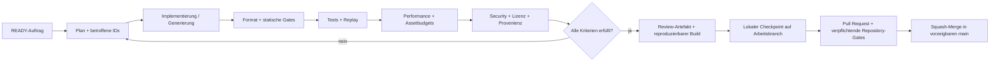

# KI-Automation und Produktionssystem

## Ziel

KI soll den überwiegenden Teil der Produktion ausführen können: Spezifikation verfeinern, Code und Tests erstellen, Assets erzeugen und cooken, Benchmarks auswerten, Fehler eingrenzen und Dokumentation aktualisieren. Automatisierung ersetzt dabei keine prüfbaren Verträge.

## Autonome Arbeitsschleife



## Geschützte GitHub-Integration

- Agenten besitzen keinen allgemeinen GitHub-Publisher und pushen niemals
  direkt auf `main`.
- Ein lokaler, repo-gebundener Integrator akzeptiert nur den festgelegten
  Arbeitsbranch und genau dieses Repository.
- Er öffnet oder aktualisiert einen Pull Request und wartet auf alle
  verpflichtenden Checks. Rote oder fehlende Gates, Konflikte, ein schmutziger
  Arbeitsbaum und abweichende Bäume blockieren den Merge fail-closed.
- Ein begrenzter frischer Reviewlauf darf belegte Integrationsfehler
  reparieren. Wiederholtes Scheitern beendet die Automation sichtbar.
- Erst nach Squash-Merge und identischem freigegebenem Baum werden lokale Refs
  neu verankert. Dadurch bleibt `main` jederzeit der abnehmbare und öffentlich
  demonstrierbare Stand.

Der Integrator verwaltet keine anderen Repositories und erweitert weder
Agentenrechte noch Modellzugriffe. Details und Begründung stehen in ADR 006.

## Einheitlicher Befehlsvertrag

Diese Aufgaben werden früh im Repository bereitgestellt und bleiben die einzige öffentliche Automationsschnittstelle:

- `bootstrap`: gepinnte Werkzeuge und Abhängigkeiten vorbereiten
- `build`: Development-Build der aktuellen Plattform
- `fmt`: Formatierung anwenden
- `lint`: Format, Toolchain-/Lizenz-/ISA-Prüfung und Daten-Schemas nur prüfen
- `test`: deterministische Tests ohne Netzwerk ausführen
- `assets-check`: Roh- und Cooked-Assets prüfen
- `plattformsmoke`: nativen linux-x64-Smoke (Fenster, GL-3.3-Dreieck, maschinenlesbarer Report) ausführen
- `effizienzbaseline`: Effizienzlauf mit Budgetgate (Startzeit, RSS, p99, Allokationen, Draw-Aufrufe) und Report ausführen
- `bench --scenario bench-empty --report PFAD`: deterministische leere Benchmarkszene (T-020) mit maschinenlesbarer Telemetrie nach NF-007 und fail-closed Budgetgate ausführen; unbekannte oder noch nicht implementierte Szenarien (`bench-army`/`-battle`/`-base`/`-path`/`-load`) schlagen mit Exitcode 25 fehl und erzeugen keinen Report. Läufe auf dem Entwickler-PC sind diagnostische Baseline gemäß Q-OPS-001; Profilbestehen entsteht nur durch deklarierte Referenzklassenbindung bei benannten Referenzrechnern
- `bench --scenario bench-sim --report PFAD`: deterministische headless Simulationsbaseline (T-021) mit festem 20-Hz-Tick und genau 250 vollständig simulierten mobilen Testagenten nativ auf linux-x64 ausführen; rein CPU-seitig ohne Fenster/Renderer, Report nach NF-007 mit Zustands-Hashkette, Budgetgate fail-closed gegen 8 ms Ziel/16 ms harte Grenze je Tick sowie die in `docs/SIMULATIONSVERTRAG.md` fixierte Allokationsgrenze je warmem Tick; dieselben Szenario-/Profil-Ehrlichkeitsregeln wie bench-empty
- `security`: Secrets, Abhängigkeiten und Lizenzen prüfen
- `check`: alle nicht verändernden lokalen Gates ausführen
- `package`: Release-Artefakt für genau einen RID erzeugen

Ein nicht implementiertes Gate muss fehlschlagen oder ausdrücklich `NICHT VERFÜGBAR` melden; es darf keinen leeren grünen Erfolg vortäuschen.

## Codeproduktion

- Jeder Auftrag verweist auf Anforderungs- und Test-IDs.
- Neue Architektur oder Abhängigkeiten erfordern ein ADR.
- Hot Paths benötigen Benchmark oder begründete Budgetzuordnung.
- Ein Budget oder passender Entwurf darf nicht als Optimierungsnachweis
  bezeichnet werden; dieser entsteht erst durch die in ADR 006 und
  `PERFORMANCE_BUDGET.md` gebundene reale Messung.
- Releasepfade dürfen keine Reflection-, Trimming- oder AOT-Warnungen unterdrücken.
- Replay-/Seed-gesteuerte Szenarien dienen als objektive Gameplayregression.
- Automatische Reviews prüfen Spezifikation, Codequalität, Performance, Sicherheit und Lizenz getrennt.

## Assetproduktion

```text
asset-spec -> generation -> raw quarantine -> validation -> normalization
           -> LOD/material/rig pass -> visual review -> cooking -> package
```

Jeder Generierungsjob erzeugt neben dem Rohasset ein Manifest mit:

- Asset-ID und fachlicher Zweck
- Prompt und Negativprompt
- Modell, Tool, Version, Seed und Ausführungsdatum
- Eingabereferenzen mit Herkunft und Lizenz
- Ausgabedateien mit SHA-256
- automatischen Prüfergebnissen
- Abstammung bei Varianten und Nachbearbeitungen
- Freigabestatus

Unbekannte Herkunft, unklare Modelllizenz oder direkte Ähnlichkeit mit einer geschützten Vorlage blockiert den Shipping-Pfad.

Speichervertrag:

- ungeprüfte Generatorausgaben: `assets/quarantine/`, lokal und gitignored
- angenommene bearbeitbare Quellen: `assets/source/`, binär über Git LFS
- Provenienz: `assets/manifests/`, normales versioniertes JSON
- reproduzierbare Laufzeitausgabe: `assets/cooked/`, gitignored

Git LFS ersetzt kein Backup. Vor dem ersten wichtigen Binärasset wird ein gesicherter LFS-Remote festgelegt und Wiederherstellung getestet.

## Menschliche Kontrollpunkte

Auch bei maximaler Automation bleiben explizite Freigaben sinnvoll für:

- endgültige Produkt- und Weltentscheidungen
- Art-Bible-Keyframes und musikalische Hauptthemen
- Lizenz- und IP-Risiken
- Änderungen der Hardware- oder Qualitätsbudgets
- Freigabe eines Meilensteins zur Inhaltsvervielfachung

Diese Kontrollpunkte sollen selten und entscheidungsorientiert sein; technische Routine wird automatisiert.

## Reproduzierbarkeit

- Runtime, Compiler, native Quellen und KI-Produktionswerkzeuge versionsgenau pinnen.
- Netzwerk ist in `test`, `check` und Runtime-Smoke-Tests standardmäßig nicht erforderlich.
- Release-Artefakte werden auf dem jeweiligen Zielbetriebssystem erstellt.
- Prompts allein gelten nicht als reproduzierbar: Modellkennung, Seed, Eingaben, Toolchain und Hashes gehören dazu.
