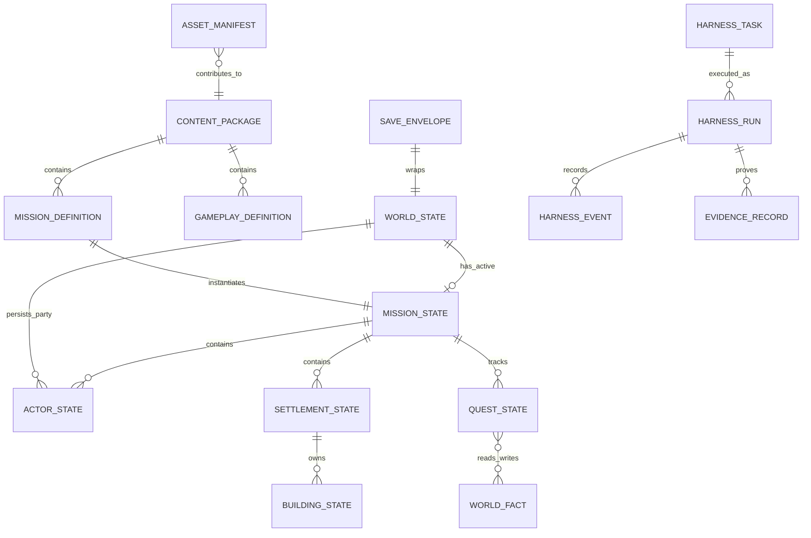

# Datenmodell

Dieses Dokument definiert das logische Modell. Speicherlayout, Binärformat und konkrete Serialisierungsbibliothek sind noch `OFFEN`; implementierende Agenten dürfen sie nicht stillschweigend festlegen. Alle persistierten Formate besitzen eine explizite Schema-Version und werden vor Nutzung validiert.

## Datenklassen

| Klasse | Beispiele | Quelle der Wahrheit | Änderung zur Laufzeit | Shipping |
|---|---|---|---|---|
| Autorisierte Definitionen | Missionen, Akteurtypen, Fähigkeiten, Gegenstände, Gebäude, Einheiten, Dialoge | versionierte Content-Quelldaten | nein | gecookt, read-only |
| Runtime-Zustand | Akteurinstanzen, Positionen, Ressourcen, Quest-/Weltfakten, Fog of War | Simulation | ja, ausschließlich durch validierte Befehle/Ereignisse | in Save enthalten |
| Präsentationszustand | Kamera, Auswahl, temporäre Effekte, UI-Fokus | Client | ja | nur soweit für Fortsetzen nötig |
| Benutzereinstellungen | Grafik, Audio, Sprache, Untertitel, Eingabebelegung | lokale Settings | ja | nein |
| Produktionsmetadaten | Asset-Provenienz, Harness-Aufträge, Runs, Evidenz und Memory | Git plus `.ai/runtime` gemäß Retention | ja, außerhalb des Clients | nein |
| Roh-/Zwischenartefakte | Blender-Dateien, Generatoroutputs, Traces, Cook-Zwischenstände | Asset-Pipeline / Quarantäne | ja | niemals direkt |

## Identitäts- und Versionsregeln

- Eine **Definitions-ID** identifiziert fachlichen Content über Builds hinweg, zum Beispiel `ABILITY-...` oder `ENV-RUIN-ARCH-001`. Sie ist unabhängig von Dateipfad, Anzeigename und Lokalisierung.
- Eine **Instanz-ID** identifiziert genau ein Laufzeitobjekt innerhalb eines Spielstands. Ihr konkretes Encoding ist `OFFEN`; sie darf nicht aus Speicheradresse oder Arrayposition abgeleitet werden.
- Beziehungen werden über IDs gespeichert. Serialisierte Objektgraphen mit impliziten Referenzen sind unzulässig.
- Schema-, Content- und Save-Version sind getrennt. Eine neue Content-Version darf einen alten Save nur laden, wenn Kompatibilität oder eine getestete Migration erklärt ist.
- Alle fachlichen Anzeigenamen und Dialogtexte sind Lokalisierungsschlüssel. Deutsch und Englisch können unabhängig geprüft werden.
- Persistierte Zeit des Spiels wird in Simulationsticks beziehungsweise definierter Spielzeit gespeichert, nicht als lokale Wanduhr. UTC-Zeit ist nur Produktions- und Dateimetadatum.
- Reihenfolgen mit Einfluss auf die Simulation besitzen eine kanonische Sortierung. Dateisystem-, Hashmap- oder Thread-Reihenfolge darf kein Spielergebnis bestimmen.

## Autorisierte Content-Definitionen

### `ContentPackageManifest`

| Feld | Typ / Format | Pflicht | Regel |
|---|---|---:|---|
| `packageId` | Definitions-ID | ja | innerhalb des Builds eindeutig |
| `packageVersion` | SemVer oder festgelegte Buildversion | ja | unveränderlich je Artefakthash |
| `schemaVersion` | positive Ganzzahl | ja | vom Client unterstützt |
| `buildId` | opaker Buildbezeichner | ja | verweist auf reproduzierbaren Build |
| `entries` | Liste aus ID, Typ, Pfad/Offset, SHA-256 und Größe | ja | kanonisch sortiert; keine Duplikate |
| `dependencies` | Paket-IDs mit erlaubtem Versionsbereich | nein | azyklisch für den Vertical Slice |
| `manifestHash` | SHA-256 | ja | deckt kanonisches Manifest ab |

### `MissionDefinition`

| Feld | Typ / Format | Pflicht | Regel |
|---|---|---:|---|
| `missionId` | Definitions-ID | ja | stabil |
| `contentVersion` | positive Ganzzahl | ja | steigt bei save-relevanter Änderung |
| `mapId` | Definitions-ID | ja | muss im Paket existieren |
| `initialActors` | geordnete Spawn-Definitionen | ja | Definition, Transform, Zugehörigkeit und Seed |
| `objectives` | Quest-/Ziel-IDs | ja | mindestens ein Abschlussziel |
| `initialFacts` | Weltfakten mit Wert | nein | keine widersprüchlichen Schlüssel |
| `victoryRules` / `failureRules` | Regel-IDs | ja | vollständig validierbar |
| `benchmarkTags` | Liste | nein | verweist auf Pflichtszenarien, falls relevant |

### Gameplay-Definitionen

| Entität | Mindestfelder | Zentrale Validierung |
|---|---|---|
| `ActorDefinition` | ID, Archetyp, Werte, Bewegungs-/Kollisionsprofil, Fähigkeitsslots, visuelle und akustische Asset-IDs | Wertebereiche; alle Verweise vorhanden; Budgetklasse angegeben |
| `AbilityDefinition` | ID, Kosten, Abklingzeit, Zielregeln, Effektfolge, Feedback-Assets | Effektfolge statisch registriert und AOT-kompatibel; Ziele eindeutig |
| `ItemDefinition` | ID, Slot/Typ, Modifikatoren, Stackregel, Asset- und Textschlüssel | keine ungültige Slotkombination; Modifikatoren begrenzt |
| `UnitDefinition` | ID, Ausbildungsanforderungen, Kosten, Werte, Befehls-/Formationsprofil | Kosten und Voraussetzungen auflösbar; Szenenbudgetklasse |
| `BuildingDefinition` | ID, Baukosten/-zeit, Platzierungsregeln, Produktion/Funktion, Footprint | Footprint und Navigation prüfbar; Produktionsgraph gültig |
| `ResourceDefinition` | ID, Text-/Iconschlüssel, Lagerregel | genau zwei im Vertical Slice; keine negativen Bestände |
| `QuestDefinition` | ID, Zustandsgraph, Voraussetzungen, Ziele, sichtbare Ergebnisse, Faktenänderungen | erreichbarer Start und Abschluss; keine ungewollten Sackgassen |
| `DialogueDefinition` | ID, Sprecher-IDs, Knoten, Optionen, Voraussetzungen, Folgen, Textschlüssel | jeder Pfad beendet sich oder verzweigt gültig; Untertitel vorhanden |
| `LocalizationEntry` | Schlüssel, Sprache, Text, optionale Platzhalter | Schlüssel vollständig; Platzhaltermengen je Sprache identisch |

Konkrete Werte, die Inhalte und Balance bestimmen – darunter die Namen und Bedeutung der zwei Ressourcen, die fünf Gebäude und vier Einheitentypen des Vertical Slice – bleiben bis zur jeweiligen Content-Spezifikation `OFFEN`.

## Laufzeit- und Save-Modell

### `WorldState`

| Feld | Typ / Format | Pflicht | Regel |
|---|---|---:|---|
| `campaignId` | Definitions-ID | ja | für den Vertical Slice ein definierter Kampagnenkontext |
| `worldFacts` | kanonische Map aus Fact-ID und typisiertem Wert | ja | nur registrierte Fakten/Typen |
| `completedMissions` | geordnete Missions-IDs mit Ergebnis-ID | ja | keine widersprüchlichen Endzustände |
| `partyRoster` | Actor-Instanz-IDs | ja | verweist auf persistente Gruppenmitglieder |
| `inventory` | Gegenstandsinstanzen / Stapel | ja | Mengen und Slots gültig |
| `currentMission` | `MissionState` oder leer | nein | höchstens eine aktive Mission im Vertical Slice |

### `MissionState`

| Feld | Typ / Format | Pflicht | Regel |
|---|---|---:|---|
| `missionId` / `contentVersion` | ID / Ganzzahl | ja | kompatibel zum geladenen Paket |
| `tick` | nichtnegative Ganzzahl | ja | monoton |
| `seed` | fester Seedtyp | ja | vollständig persistiert |
| `actors` | kanonisch geordnete `ActorState`-Sammlung | ja | eindeutige Instanz-IDs |
| `settlements` | `SettlementState`-Sammlung | ja | Ressourcen- und Besitzregeln gültig |
| `quests` | `QuestState`-Sammlung | ja | Transitionen aus Definition ableitbar |
| `worldFacts` | Map aus Fact-ID und Wert | ja | Missionsscope überschreibt nicht still Kampagnenscope |
| `fogOfWar` | versioniertes Sichtbarkeitsraster/-format | ja | Dimension passt zur Karte |
| `pendingCommands` | geordnete Befehle | falls benötigt | keine Befehle aus der Zukunft außerhalb des erlaubten Fensters |
| `stateHash` | deterministischer Hash | bei Test/Replay | aus kanonischem sim-relevantem Zustand |

### Zentrale Zustandsentitäten

| Entität | Mindestzustand | Invarianten |
|---|---|---|
| `ActorState` | Instanz-/Definitions-ID, Transform, Zugehörigkeit, Vitalwerte, Status, Cooldowns, Ausrüstung, aktuelle Order | Werte in zulässigen Grenzen; Definition existiert; tote/entfernte Akteure führen keine neuen Orders aus |
| `ItemInstance` | Instanz-/Definitions-ID, Menge, optionaler Zustand/Modifikator | positive Menge; Stapelregel eingehalten |
| `SettlementState` | Instanz-ID, Eigentümer, Ressourcenbestände, Gebäude, Produktionswarteschlangen | Bestände nicht negativ; Warteschlangen referenziell gültig |
| `BuildingState` | Instanz-/Definitions-ID, Transform, Baufortschritt, Zustand, Produktionsstatus | gültige Platzierung; Fortschritt begrenzt; Footprint konsistent |
| `SquadState` | ID, geordnete Mitglieds-IDs, Formation, Order | Mitglieder existieren, gehören derselben kontrollierenden Seite und sind höchstens einem Verband zugeordnet |
| `QuestState` | Quest-ID, Zustand/Knoten, erfüllte Ziele, gewählte Option, relevante Fakten | Transition muss im Questgraph erlaubt sein; irreversible Wahl genau einmal |
| `WorldFact` | Fact-ID, deklarierter Typ, Wert, Geltungsbereich | Typ passt zur Definition; Kampagnen- und Missionsscope explizit |
| `PlayerCommand` | Ziel-Tick, Spieler/Quelle, Sequenz, Aktion, Zielparameter | erlaubte Aktion, erreichbare Instanzen, validierte Parameter; total geordnet |

Ob Gameplay-Numerik intern Festkomma, kontrollierte Fließkommazahlen oder eine Kombination verwendet, wird im Determinismus-Spike entschieden. Bis dahin dürfen weder exakte Cross-Plattform-Hashes versprochen noch tolerierte Abweichungen erfunden werden.

### `SaveEnvelope`

| Feld | Typ / Format | Pflicht | Regel |
|---|---|---:|---|
| `saveSchemaVersion` | positive Ganzzahl | ja | vor Payload lesen |
| `saveId` | opake ID | ja | stabil für Slot/Autosave |
| `createdAtUtc` / `updatedAtUtc` | ISO-8601 UTC | ja | nur Metadaten, nicht Simulationslogik |
| `buildId` | Bezeichner | ja | Diagnose und Kompatibilität |
| `contentPackages` | IDs, Versionen und Hashes | ja | Kompatibilität vor Laden prüfen |
| `displayMetadata` | lokalisierbarer Ort, Spielzeit, optionales Vorschaubild | ja | ohne vollständige Payload lesbar |
| `worldState` | versionierter Payload | ja | vollständig validiert, bevor aktiver Zustand ersetzt wird |
| `payloadHash` | SHA-256 oder gleichwertig dokumentiert | ja | Korruption erkennen, kein Manipulationsschutzversprechen |

Spielstandintegrität dient der Fehlererkennung. Eine Signatur oder Anti-Cheat-Grenze ist für das Offline-Einzelspiel kein Ziel.

### `PlayerSettings`

| Gruppe | Inhalt | Regel |
|---|---|---|
| Grafik | Auflösung, Fensterart, Qualitätsprofil, VSync/Framelimit, UI-Skalierung | sichere Fallbackwerte; Hardwareprofile werden nicht überschrieben |
| Audio | Master-, Musik-, Effekt-, Umgebungs- und Sprachlautstärke | jeweils begrenzt; Sprache optional |
| Sprache / Text | UI-/Textsprache, Untertitel, Textgröße, Dialogtempo | Untertitel unabhängig von Sprachausgabe |
| Eingabe | semantische Aktion → eine oder mehrere Bindings | Konflikt sichtbar; Wiederherstellung der Defaults möglich |
| Zugänglichkeit | Farb-/Kontrastoptionen und weitere bestätigte Hilfen | keine Kerninformation ausschließlich farbcodiert |

Gerätespezifische Scancodes dürfen gespeichert werden, aber die Gameplaylogik kennt nur semantische Aktionen wie `Select`, `Move`, `Attack` oder `AbilitySlot1`.

## Produktionsmodell

| Entität | Zweck | Verbindliche Felder / Quelle |
|---|---|---|
| `AssetManifest` | Herkunft und technische Freigabe eines Assets | Schema `.ai/schemas/asset-manifest.schema.json`; Asset-ID, Inputs, Tool/Modell/Version/Seed, Hashes, Lizenzgrundlage, Prüfergebnisse, Abstammung und Status |
| `HarnessTask` | begrenzter autonomer Auftrag | Task-ID, Status, Scope, Nicht-Scope, Anforderungen, Kriterien und erlaubte Entscheidungen |
| `HarnessRun` | reproduzierbarer Ausführungsrahmen | Run-ID, Task-/Prompt-/Git-/Toolstand, Start/Ende und Abschlussstatus |
| `HarnessEvent` | append-only Ablaufbeleg | Sequenz, UTC, Akteur, Typ, bereinigte Payload, Vorgänger- und Ereignishash |
| `RetrievalRecord` | tatsächlich verwendeter RAG-Kontext | Query, Indexhash, Treffer-IDs, Pfade, Zeilen und Quellhashes |
| `EvidenceRecord` | Zuordnung von Prüfung zu Kriterium | Kriteriums-ID, Befehl/Umgebung, Ergebnis, Artefakthash und Zeitpunkt |
| `MemoryRecord` | atomare kuratierte Erkenntnis | ID, Behauptung, Status, Quelle+Hash, Gültigkeit, optional `supersedes`/`expiresAtUtc` |

Roh-Runlogs sind Verlauf, keine fachliche Wahrheit. Nur separat angenommene, nicht veraltete Memory-Records dürfen als Gedächtnis abgerufen werden.

## Beziehungen

## Validierungs- und Lebenszyklusregeln

### Content

1. Quelle wird mit stabilen IDs und Schema-Version erstellt.
2. Referenzen, Wertebereiche, Graphen, Lokalisierung und Hardwarebudgets werden validiert.
3. Assets bleiben bis Provenienz-, Lizenz-, Ähnlichkeits-, Technik- und visueller Prüfung in Quarantäne.
4. Der Cooker erzeugt ein unveränderliches Paketmanifest mit Hashes.
5. Nur freigegebene Pakete gelangen in Test- oder Shipping-Builds.
6. Ersetzte Definitionen bleiben nur erhalten, solange Save-Migration oder Reproduzierbarkeit dies erfordert.

### Spielstand

1. Die Simulation erzeugt an einem sicheren Tick einen konsistenten Snapshot.
2. Der Snapshot wird mit Paket- und Schema-Version in ein temporäres Envelope geschrieben.
3. Lesen, Größenlimits und Hash werden geprüft; erst dann wird der bisherige Slot atomar ersetzt.
4. Beim Laden wird in einen getrennten Zustand deserialisiert, vollständig validiert und erst danach aktiviert.
5. Migrationen laufen schrittweise und idempotent auf Kopien; ein Fehler erhält den Originalstand.
6. Löschen eines Slots ist eine bewusste lokale Nutzeraktion. Ob ein Papierkorb-/Undo-Verhalten angeboten wird, ist `OFFEN`.

### Harness und Gedächtnis

1. Ein `READY`-Task startet einen Run mit gepinntem Kontext.
2. Ereignisse und Retrieval werden bereinigt, geordnet und hashverkettet gespeichert.
3. Erkenntnisse beginnen als `proposed`; ein getrennter Review nimmt sie an, lehnt sie ab oder ersetzt ältere Records.
4. Geänderte Quellhashes machen abhängige Indexchunks und Memory-Records veraltet.
5. Lokale Roh-Runs bleiben mindestens 180 Tage; bereinigte akzeptierte Historie und Memory werden versioniert.

## Migration und Testdaten

- Es gibt keine zu übernehmende Altdatenquelle. Fremde Spielstände oder Inhalte werden nicht importiert.
- Jede Schema-Version benötigt Golden Fixtures für: minimal gültig, finalitätsnah gültig, unbekannte Version, fehlende Referenz, Grenzwertverletzung, abgeschnittene Datei und falscher Hash.
- Save-Migrationen benötigen Vorher-/Nachher-Fixtures und müssen bei wiederholter Ausführung dasselbe Ergebnis liefern.
- Deterministische Replays speichern mindestens Build-/Contentkennung, Seed, Startzustand und geordnete Befehle; genaues Replayformat ist `OFFEN`.
- Produktionsfixtures enthalten keine Secrets, personenbezogenen Daten oder fremden geschützten Inhalte.

## Aufbewahrung und Sensibilität

Der Spielclient verarbeitet keine Konten, Zahlungsdaten oder notwendige Onlinetelemetrie. Lokale Saves und Settings gehören dem Spieler und bleiben bis zur bewussten Löschung bestehen. Entwicklungslogs dürfen lokale Pfade und Gerätewerte nur soweit erforderlich enthalten und keine Tokens, Prompt-Secrets oder Rohinhalte fremder Anbieter persistieren. Große Produktionsartefakte erhalten eine Retention- und Backupentscheidung, sobald der Artefaktspeicher gewählt wird.
