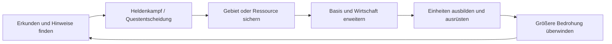

# Game-Design-Rahmen

## Designziel

**Status:** ANGENOMMEN

Project Riftward verbindet zwei Maßstäbe ohne harten Genrebruch:

1. Eine kleine persistente Heldengruppe erkundet, spricht, löst Aufgaben, findet Ausrüstung und kämpft taktisch.
2. Dieselbe Gruppe erschließt sichere Orte, organisiert Ressourcen, errichtet eine Basis und führt größere Verbände.
3. Entscheidungen und Veränderungen bleiben auf einer Kampagnenkarte nachvollziehbar.

## Atmosphärische Säulen

- **Melancholische Weite:** alte Landschaften, verlassene Bauwerke, lange Sichtachsen, ruhige Passagen zwischen Konflikten.
- **Macht mit Gewicht:** neue Fähigkeiten, Gebäude und Einheiten werden verdient und verändern den Handlungsraum sichtbar.
- **Zwei Maßstäbe, eine Welt:** Heldentaten öffnen strategische Optionen; die Siedlung unterstützt wiederum die Helden.
- **Lesbarkeit vor Spektakel:** klare Silhouetten, verständliche Effekte und deutliche Rückmeldung auch in großen Gruppen.
- **Eigenständiges Mysterium:** neue Mythologie, Kulturen, Magieregeln, Architektursprachen und musikalische Motive.

## Kernschleife

## Spielsysteme

| ID | System | Vertical Slice | Vollprodukt | Status |
|---|---|---|---|---|
| GS-001 | Kamera, Auswahl und Befehle | vollständig | erweitert | ANGENOMMEN |
| GS-002 | Heldengruppe, Werte, Fähigkeiten, Ausrüstung | 1 Hauptfigur + 2 Begleiter | persistente Gruppe | ANGENOMMEN |
| GS-003 | Dialoge, Aufgaben und Entscheidungen | 1 verzweigtes Aufgabenpaket | Kampagne | ANGENOMMEN |
| GS-004 | Basisbau und Ressourcen | 2 Ressourcen, 5 Gebäudetypen | mehrere Wirtschaften | ANGENOMMEN |
| GS-005 | Einheiten und Formationen | 4 eigene Einheitentypen | mehrere Kulturen | ANGENOMMEN |
| GS-006 | Gegner und taktische KI | 4 Archetypen + Boss | Fraktionen und Kreaturen | ANGENOMMEN |
| GS-007 | Nebel des Krieges und Aufklärung | ja | erweitert | ANGENOMMEN |
| GS-008 | Speichern, Laden und Checkpoints | ja | ja | ANGENOMMEN |
| GS-009 | Kampagnenfortschritt | Abschlusszustand | persistente Weltkarte | ANGENOMMEN |

## Vertical Slice VS-001

### Spielerlebnis

Eine 20–30-minütige Karte beginnt mit der Heldengruppe in einer fremden Ruinenlandschaft. Erkundung und ein Dialog führen zu einem taktischen Gefecht. Danach wird ein eigener Stützpunkt errichtet, eine kleine Wirtschaft aufgebaut und ein gemischter Verband für den Angriff auf eine befestigte Bedrohung vorbereitet. Eine Entscheidung verändert mindestens einen späteren Kampf oder verfügbaren Verbündeten.

### Muss-Inhalt

- 1 finalitätsnahe Karte mit Erkundungs-, Basis- und Kampfzone
- 1 steuerbare Hauptfigur, 2 Begleiter, 4 Fähigkeiten je aktiver Figur als Obergrenze
- 2 Ressourcen, 5 Gebäude, 4 ausbildbare Einheitentypen
- 4 normale Gegnertypen, 1 Elitevariante, 1 Boss
- 1 Dialogkette und 1 Aufgabe mit mindestens 2 sichtbaren Ausgängen
- Fog of War, Minimap, Auswahlgruppen, Formationsbewegung und kontextuelle Befehle
- Speichern/Laden, Grafik-/Audio-/Eingabeeinstellungen
- deutsche und englische Textstruktur; finale Übersetzungsmenge noch OFFEN
- automatisierter Benchmarklauf und deterministischer Gameplay-Smoke-Test

### Nicht-Ziele des Vertical Slice

- große Kampagne, Multiplayer, Modding, prozedurale Welt
- vollständiger visueller Editor
- große Anzahl Kulturen, Biome oder Charakterklassen
- filmische Zwischensequenzen mit Gesichts-Nahaufnahmen

## Vollprodukt-Hypothese

**Status:** OFFEN, nicht umsetzungsbereit

Die Anzahl an Karten, Kulturen, Spielstunden, Helden und Einheiten wird erst nach Messung der KI-Content-Pipeline und Abnahme des Vertical Slice festgelegt. Qualität, Konsistenz und Wartbarkeit haben Vorrang vor nomineller Inhaltsmenge.

## Verbotene Abkürzungen

- keine Mechanik erhält nur deshalb einen Namen, eine Darstellung oder konkrete Ausprägung, weil eine Inspirationsvorlage dies so tut
- keine Platzhalter aus extrahierten oder nachgebauten Originalassets
- kein ungeprüfter KI-Content direkt im Shipping-Build
- keine versteckten Online-, Konto- oder Telemetriepflichten
