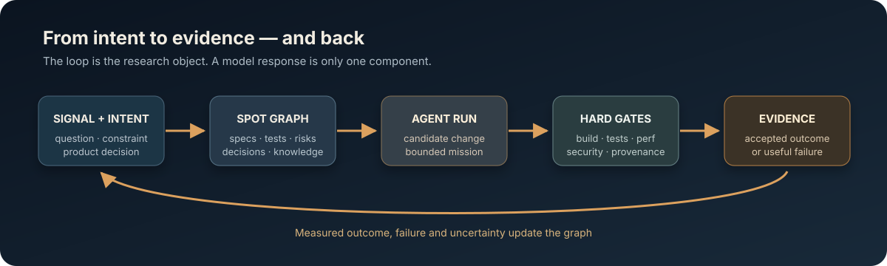

# Forschungsfallstudie: Project Riftward

Project Riftward ist gleichzeitig ein Spielprojekt und ein offenes
Engineering-Experiment. Untersucht wird, wie weit eine agentische
Software-Lieferkette unter harten Qualitätsgates tatsächlich kommt und ob ein
modern wirkender RTS/RPG-Hybrid auf bewusst alter beziehungsweise kleiner
Hardware tragfähig ist.

Der Codename und alle Bilder sind vorläufig. Der aktuelle Stand ist kein
fertiges Spiel: Das reproduzierbare Produktionsfundament ist aufgebaut, die
Spielruntime beginnt mit `T-010`.

## Forschungsfragen

1. Wie lange und wie zuverlässig kann eine KI aus einer klaren Mission ohne
   menschliche Eingriffe arbeiten?
2. Welche Spezifikationen, Orakel und Gates erhöhen Autonomie, ohne nur Fehler
   schneller zu produzieren?
3. Welche visuelle und spielerische Qualität ist bei 1080p/30 FPS auf
   i7-3770-/GTX-660-Klasse oder M1 mit 8 GB erreichbar?
4. Kann hoher einmaliger Entwicklungs-Compute über viele Installationen und
   Spielsitzungen hinweg geringere Endgeräteanforderungen rechtfertigen?
5. Welche Teile einer vollständigen SDLC lassen sich zuverlässig agentisch
   schließen und wo bleiben menschliche Produkt-, Risiko- und
   Freigabeentscheidungen unverzichtbar?
6. Wie viel der üblichen Hardware-Eskalation lässt sich durch einen kleinen
   eigenen Runtime-Unterbau, gezielte Daten-/Renderoptimierung und bewusst
   begrenzte Inhalte vermeiden, ohne Spielsystem, Lesbarkeit oder Atmosphäre
   nur wegzusparen?

## Keine vorweggenommene These

„Lieber einmal Rechenzentrum als überall stärkere Gaming-Hardware“ ist hier
eine zu prüfende Hypothese, keine Umweltbehauptung. Für eine belastbare Aussage
fehlen insbesondere providerseitige Compute-/Energiedaten, Stückzahlen,
Lebenszyklusdaten der Endgeräte, Nutzungsdauer und Rebound-Effekte. Das Projekt
publiziert deshalb auch Nullresultate, Kosten, Fehlversuche und Datenlücken.

Die politische Position des Projekts ist dennoch eindeutig: Effizienz ist
Produktqualität. Ein DDR3-PC, ein Linux-Desktop oder ein M1 mit 8 GB sollen
nicht vorschnell als unzureichend gelten, solange Messung und harte
Optimierung noch ungenutzten Spielraum zeigen. Daraus folgt keine pauschale
Abwertung moderner Spiele oder Betriebssysteme; genau diese Grenze trennt
Position, Hypothese und belegten Befund.

## Einstieg

- [Forschungsprotokoll](PROTOCOL.md)
- [Abbildung auf CCD](CCD_MAPPING.md)
- [laufendes Fallstudienprotokoll](CASE_STUDY_LOG.md)
- [Kampagnen- und Veröffentlichungsplan](../communication/CAMPAIGN.md)
- [Visual-/Media-Lab](../communication/MEDIA_LAB.md)
- [Hardware- und Performancebudgets](../PERFORMANCE_BUDGET.md)
- [Agent-Harness und Evidenz](../HARNESS.md)

Die Fallstudie versteht sich als praktische Sonde für
[Cong-Driven Development](https://github.com/Koschnag/cong-driven-development)
und die im Artikel
[„Software Engineering im KI-Zeitalter: Gegenthese zum Hype“](https://de.linkedin.com/pulse/software-engineering-im-ki-zeitalter-gegenthese-zum-hype-nguyen-imnof)
beschriebene Arbeit *am System* statt nur *im System*. Sie behauptet derzeit
weder eine vollständige CCD-Konformität noch eine generalisierbare
Überlegenheit agentischer Entwicklung.
